

Animations, architecture and 3D worlds made with Qwen 4. Click a cover to watch on BeatAPI.

**[Watch all cases →](https://beatapi.io/qwen4-videos?utm_source=github&utm_medium=gallery&utm_campaign=awesome-qwen4-videos)** · [Qwen 4 API](https://beatapi.io/qwen4-api?utm_source=github&utm_medium=gallery&utm_campaign=awesome-qwen4-videos) · [中文](README.zh-CN.md) · **100 cases · 101 videos · 31 published prompts**

## Six highlights

<table>
<tr>
<td width="33%" valign="top"> <a href="https://beatapi.io/prompts/qwen4/temple-of-heaven-131506?utm_source=github&amp;utm_medium=gallery&amp;utm_campaign=awesome-qwen4-videos"><strong>Temple of Heaven: sketch to color</strong></a> Max-Preview · Three.js · 45s <a href="cases/temple-of-heaven-131506.md">Case notes</a> · <a href="https://x.com/NFT_Chen/status/2120777011065131506">@NFT_Chen</a></td>
<td width="33%" valign="top"> <a href="https://beatapi.io/prompts/qwen4/mechanical-hummingbird-069800?utm_source=github&amp;utm_medium=gallery&amp;utm_campaign=awesome-qwen4-videos"><strong>Mechanical hummingbird and flower</strong></a> Max-Preview · 67s <a href="cases/mechanical-hummingbird-069800.md">Case notes</a> · <a href="https://x.com/ItsmeAjayKV/status/2120676196921069800">@ItsmeAjayKV</a></td>
<td width="33%" valign="top"> <a href="https://beatapi.io/prompts/qwen4/fisherman-oil-portrait-932340?utm_source=github&amp;utm_medium=gallery&amp;utm_campaign=awesome-qwen4-videos"><strong>Painting a fisherman, stroke by stroke</strong></a> Max-Preview · Canvas · 30s <a href="cases/fisherman-oil-portrait-932340.md">Prompt</a> · <a href="https://x.com/ItsmeAjayKV/status/2122038770421932340">@ItsmeAjayKV</a></td>
</tr>
<tr>
<td width="33%" valign="top"> <a href="https://beatapi.io/prompts/qwen4/floating-water-house-021434?utm_source=github&amp;utm_medium=gallery&amp;utm_campaign=awesome-qwen4-videos"><strong>Blender water-house camera tour</strong></a> Max · Blender · 40s <a href="cases/floating-water-house-021434.md">Case notes</a> · <a href="https://x.com/NFT_Chen/status/2122265524877021434">@NFT_Chen</a></td>
<td width="33%" valign="top"> <a href="https://beatapi.io/prompts/qwen4/folding-drone-251469?utm_source=github&amp;utm_medium=gallery&amp;utm_campaign=awesome-qwen4-videos"><strong>Folding drone and exploded view</strong></a> Max-Preview · Qoder · 20s <a href="cases/folding-drone-251469.md">Case notes</a> · <a href="https://x.com/elvar_official/status/2120537937406251469">@elvar_official</a></td>
<td width="33%" valign="top"> <a href="https://beatapi.io/prompts/qwen4/floating-moss-garden-563391?utm_source=github&amp;utm_medium=gallery&amp;utm_campaign=awesome-qwen4-videos"><strong>Floating moss garden in mist and rain</strong></a> Max · Blender · Qoder · 37s <a href="cases/floating-moss-garden-563391.md">Case notes</a> · <a href="https://x.com/tanglele0318/status/2122264972889563391">@tanglele0318</a></td>
</tr>
</table>

## Browse by category

[Architecture & building](#architecture) · 14 · [Animation & explainers](#animation) · 43 · [3D worlds & games](#worlds) · 37 · [Workflow comparisons](#workflows) · 6 · [How to use](#how-to-use) · [Credits](#credits)

## Architecture & building

14 cases in total; 2 featured above, 12 more below.

Featured in this category：[Temple of Heaven: sketch to color](https://beatapi.io/prompts/qwen4/temple-of-heaven-131506?utm_source=github&utm_medium=gallery&utm_campaign=awesome-qwen4-videos) · [Blender water-house camera tour](https://beatapi.io/prompts/qwen4/floating-water-house-021434?utm_source=github&utm_medium=gallery&utm_campaign=awesome-qwen4-videos)

<table>
<tr>
<td width="33%" valign="top"> <a href="https://beatapi.io/prompts/qwen4/voxel-eiffel-966418?utm_source=github&amp;utm_medium=gallery&amp;utm_campaign=awesome-qwen4-videos"><strong>Voxel Eiffel Tower scene</strong></a> Max · OpenCode · 86s <a href="cases/voxel-eiffel-966418.md">Case notes</a> · <a href="https://x.com/nawariokra/status/2122206601217966418">@nawariokra</a></td>
<td width="33%" valign="top"><a href="https://beatapi.io/prompts/qwen4/voxel-pagoda-garden-844876?utm_source=github&amp;utm_medium=gallery&amp;utm_campaign=awesome-qwen4-videos">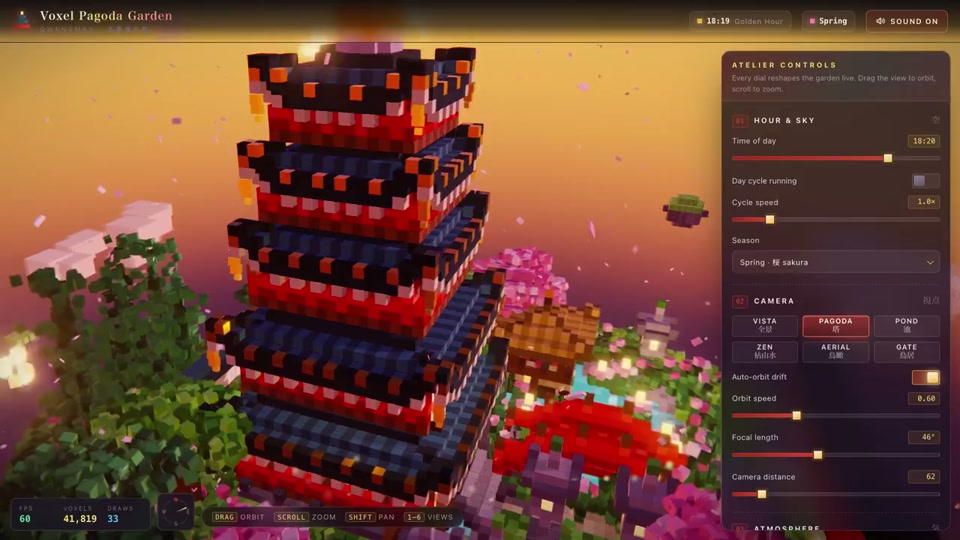</a> <a href="https://beatapi.io/prompts/qwen4/voxel-pagoda-garden-844876?utm_source=github&amp;utm_medium=gallery&amp;utm_campaign=awesome-qwen4-videos"><strong>Voxel pagoda garden</strong></a> Max-Preview · Qoder · 95s <a href="cases/voxel-pagoda-garden-844876.md">Case notes</a> · <a href="https://x.com/Chris_Wozniczek/status/2121680565111844876">@Chris_Wozniczek</a></td>
<td width="33%" valign="top"><a href="https://beatapi.io/prompts/qwen4/voxel-medieval-kingdom-236635?utm_source=github&amp;utm_medium=gallery&amp;utm_campaign=awesome-qwen4-videos">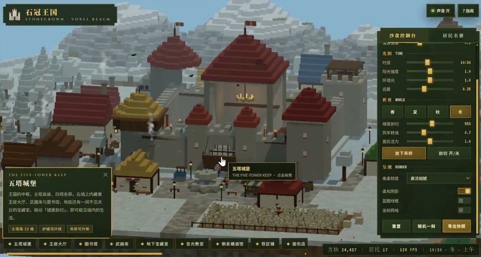</a> <a href="https://beatapi.io/prompts/qwen4/voxel-medieval-kingdom-236635?utm_source=github&amp;utm_medium=gallery&amp;utm_campaign=awesome-qwen4-videos"><strong>Voxel medieval kingdom</strong></a> Max · Three.js · 48s <a href="cases/voxel-medieval-kingdom-236635.md">Case notes</a> · <a href="https://x.com/dragono64v/status/2122198718829236635">@dragono64v</a></td>
</tr>
<tr>
<td width="33%" valign="top"> <a href="https://beatapi.io/prompts/qwen4/london-sky-diorama-930161?utm_source=github&amp;utm_medium=gallery&amp;utm_campaign=awesome-qwen4-videos"><strong>London floating-island diorama</strong></a> Variant unspecified · 12s <a href="cases/london-sky-diorama-930161.md">Prompt</a> · <a href="https://x.com/RezAIT00/status/2122170984832930161">@RezAIT00</a></td>
<td width="33%" valign="top"><a href="https://beatapi.io/prompts/qwen4/voxel-pagoda-205870?utm_source=github&amp;utm_medium=gallery&amp;utm_campaign=awesome-qwen4-videos">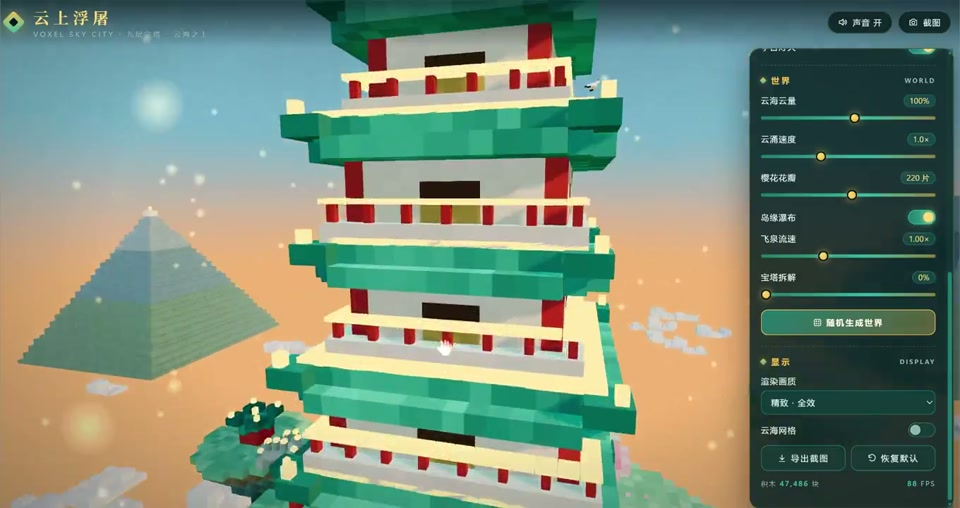</a> <a href="https://beatapi.io/prompts/qwen4/voxel-pagoda-205870?utm_source=github&amp;utm_medium=gallery&amp;utm_campaign=awesome-qwen4-videos"><strong>Voxel pagoda study</strong></a> Max · 32s <a href="cases/voxel-pagoda-205870.md">Case notes</a> · <a href="https://x.com/dragono64v/status/2122170904063205870">@dragono64v</a></td>
<td width="33%" valign="top"> <a href="https://beatapi.io/prompts/qwen4/liberty-island-1886-433422?utm_source=github&amp;utm_medium=gallery&amp;utm_campaign=awesome-qwen4-videos"><strong>Liberty Island in 1886</strong></a> Max-Preview · DeepSeek Harness · 57s <a href="cases/liberty-island-1886-433422.md">Prompt</a> · <a href="https://x.com/EamonMcKiernan5/status/2121946431703433422">@EamonMcKiernan5</a></td>
</tr>
<tr>
<td width="33%" valign="top"><a href="https://beatapi.io/prompts/qwen4/alderbrook-village-452105?utm_source=github&amp;utm_medium=gallery&amp;utm_campaign=awesome-qwen4-videos">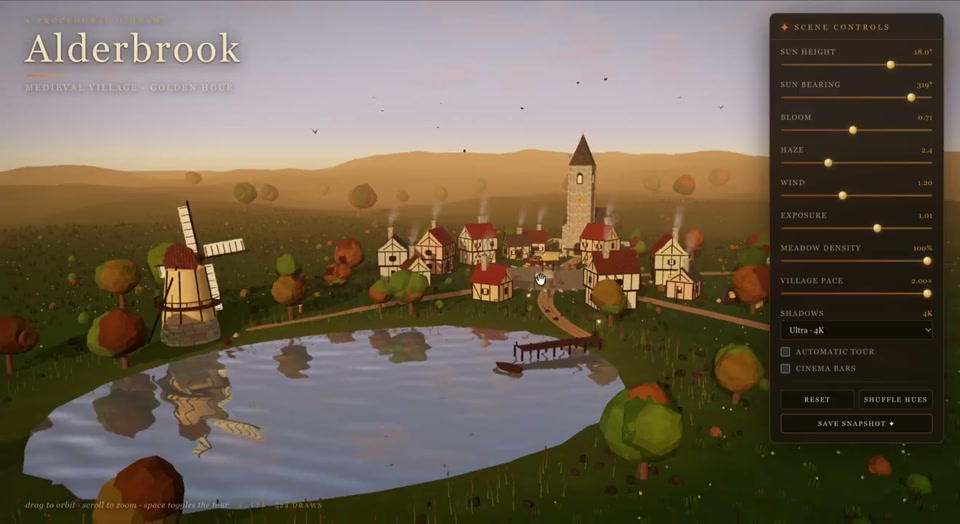</a> <a href="https://beatapi.io/prompts/qwen4/alderbrook-village-452105?utm_source=github&amp;utm_medium=gallery&amp;utm_campaign=awesome-qwen4-videos"><strong>Alderbrook village diorama</strong></a> Max-Preview · DeepSeek Harness · Qwen Code · 73s <a href="cases/alderbrook-village-452105.md">Case notes</a> · <a href="https://x.com/EamonMcKiernan5/status/2121933560680452105">@EamonMcKiernan5</a></td>
<td width="33%" valign="top"><a href="https://beatapi.io/prompts/qwen4/maeklong-market-118507?utm_source=github&amp;utm_medium=gallery&amp;utm_campaign=awesome-qwen4-videos">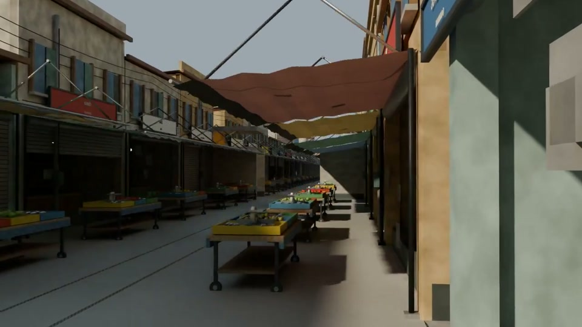</a> <a href="https://beatapi.io/prompts/qwen4/maeklong-market-118507?utm_source=github&amp;utm_medium=gallery&amp;utm_campaign=awesome-qwen4-videos"><strong>Maeklong railway market in Blender</strong></a> Max · Blender · 18s <a href="cases/maeklong-market-118507.md">Case notes</a> · <a href="https://x.com/Fferr16/status/2122299846422118507">@Fferr16</a></td>
<td width="33%" valign="top"> <a href="https://beatapi.io/prompts/qwen4/up-house-comparison-033620?utm_source=github&amp;utm_medium=gallery&amp;utm_campaign=awesome-qwen4-videos"><strong>Up house: model comparison</strong></a> Max · 37s <a href="cases/up-house-comparison-033620.md">Case notes</a> · <a href="https://x.com/noclipepe/status/2122253925588033620">@noclipepe</a></td>
</tr>
<tr>
<td width="33%" valign="top"> <a href="https://beatapi.io/prompts/qwen4/alpine-ski-village-349037?utm_source=github&amp;utm_medium=gallery&amp;utm_campaign=awesome-qwen4-videos"><strong>Alpine ski village diorama</strong></a> Max · 24s <a href="cases/alpine-ski-village-349037.md">Case notes</a> · <a href="https://x.com/manateelazycat/status/2122244867099349037">@manateelazycat</a></td>
<td width="33%" valign="top"> <a href="https://beatapi.io/prompts/qwen4/jiangnan-courtyard-494031?utm_source=github&amp;utm_medium=gallery&amp;utm_campaign=awesome-qwen4-videos"><strong>Moonlit Jiangnan courtyard</strong></a> Max-Preview · Blender · Qoder · 12s <a href="cases/jiangnan-courtyard-494031.md">Prompt</a> · <a href="https://x.com/bozhou_ai/status/2120528130599494031">@bozhou_ai</a></td>
<td width="33%" valign="top"> <a href="https://beatapi.io/prompts/qwen4/medieval-castle-953888?utm_source=github&amp;utm_medium=gallery&amp;utm_campaign=awesome-qwen4-videos"><strong>Medieval castle built with Qwen Code</strong></a> Max-Preview · Qwen Code · 30s <a href="cases/medieval-castle-953888.md">Case notes</a> · <a href="https://x.com/loktar00/status/2119193426419953888">@loktar00</a></td>
</tr>
</table>

## Animation & explainers

43 cases in total; 3 featured above, 40 more below.

Featured in this category：[Mechanical hummingbird and flower](https://beatapi.io/prompts/qwen4/mechanical-hummingbird-069800?utm_source=github&utm_medium=gallery&utm_campaign=awesome-qwen4-videos) · [Painting a fisherman, stroke by stroke](https://beatapi.io/prompts/qwen4/fisherman-oil-portrait-932340?utm_source=github&utm_medium=gallery&utm_campaign=awesome-qwen4-videos) · [Folding drone and exploded view](https://beatapi.io/prompts/qwen4/folding-drone-251469?utm_source=github&utm_medium=gallery&utm_campaign=awesome-qwen4-videos)

<table>
<tr>
<td width="33%" valign="top"> <a href="https://beatapi.io/prompts/qwen4/sunbeam-short-film-845187?utm_source=github&amp;utm_medium=gallery&amp;utm_campaign=awesome-qwen4-videos"><strong>A mascot chases a sunbeam</strong></a> Max-Preview · Qoder · 20s <a href="cases/sunbeam-short-film-845187.md">Case notes</a> · <a href="https://x.com/seeconvm/status/2120547180670845187">@seeconvm</a></td>
<td width="33%" valign="top"> <a href="https://beatapi.io/prompts/qwen4/pelican-3d-468988?utm_source=github&amp;utm_medium=gallery&amp;utm_campaign=awesome-qwen4-videos"><strong>3D pelican bicycle ride</strong></a> Max · 18s <a href="cases/pelican-3d-468988.md">Case notes</a> · <a href="https://x.com/Henry_Fan_lh/status/2122256776246468988">@Henry_Fan_lh</a></td>
<td width="33%" valign="top"> <a href="https://beatapi.io/prompts/qwen4/internet-machine-223996?utm_source=github&amp;utm_medium=gallery&amp;utm_campaign=awesome-qwen4-videos"><strong>The internet inside one machine</strong></a> Max · Three.js · 114s <a href="cases/internet-machine-223996.md">Case notes</a> · <a href="https://x.com/Sabbirbyte/status/2122196988838223996">@Sabbirbyte</a></td>
</tr>
<tr>
<td width="33%" valign="top"><a href="https://beatapi.io/prompts/qwen4/svg-pelican-750020?utm_source=github&amp;utm_medium=gallery&amp;utm_campaign=awesome-qwen4-videos">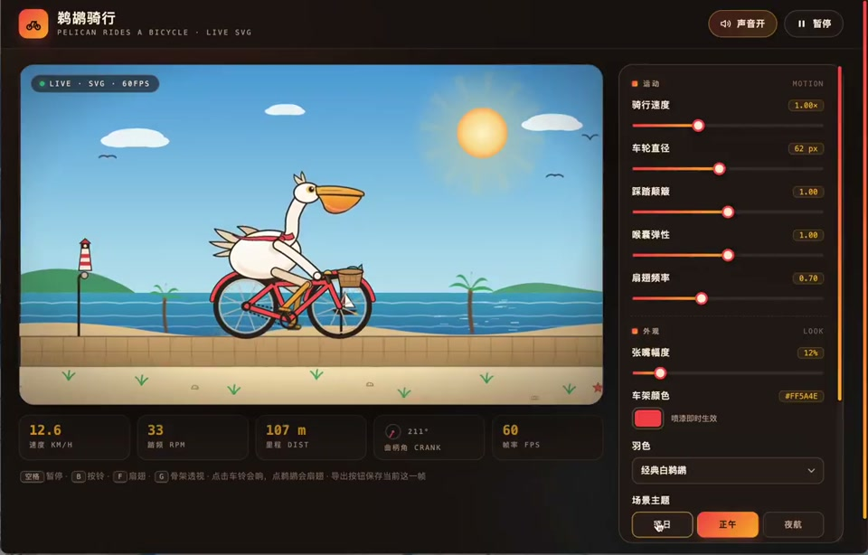</a> <a href="https://beatapi.io/prompts/qwen4/svg-pelican-750020?utm_source=github&amp;utm_medium=gallery&amp;utm_campaign=awesome-qwen4-videos"><strong>SVG pelican bicycle animation</strong></a> Max-Preview · HTML · SVG · 38s <a href="cases/svg-pelican-750020.md">Prompt</a> · <a href="https://x.com/Aurora0x3f/status/2122169039061750020">@Aurora0x3f</a></td>
<td width="33%" valign="top"><a href="https://beatapi.io/prompts/qwen4/wukong-airplane-033439?utm_source=github&amp;utm_medium=gallery&amp;utm_campaign=awesome-qwen4-videos">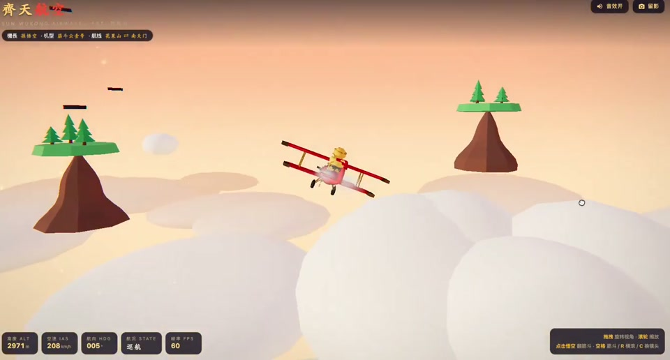</a> <a href="https://beatapi.io/prompts/qwen4/wukong-airplane-033439?utm_source=github&amp;utm_medium=gallery&amp;utm_campaign=awesome-qwen4-videos"><strong>Wukong flies a plane</strong></a> Max-Preview · HTML · Qoder · 86s <a href="cases/wukong-airplane-033439.md">Case notes</a> · <a href="https://x.com/leo114119/status/2120371909624033439">@leo114119</a></td>
<td width="33%" valign="top"> <a href="https://beatapi.io/prompts/qwen4/breathing-creature-495448?utm_source=github&amp;utm_medium=gallery&amp;utm_campaign=awesome-qwen4-videos"><strong>A breathing, blooming 3D creature</strong></a> Variant unspecified · Three.js · 26s <a href="cases/breathing-creature-495448.md">Case notes</a> · <a href="https://x.com/kayshen_xu/status/2122217886408495448">@kayshen_xu</a></td>
</tr>
<tr>
<td width="33%" valign="top"><a href="https://beatapi.io/prompts/qwen4/spider-web-214830?utm_source=github&amp;utm_medium=gallery&amp;utm_campaign=awesome-qwen4-videos">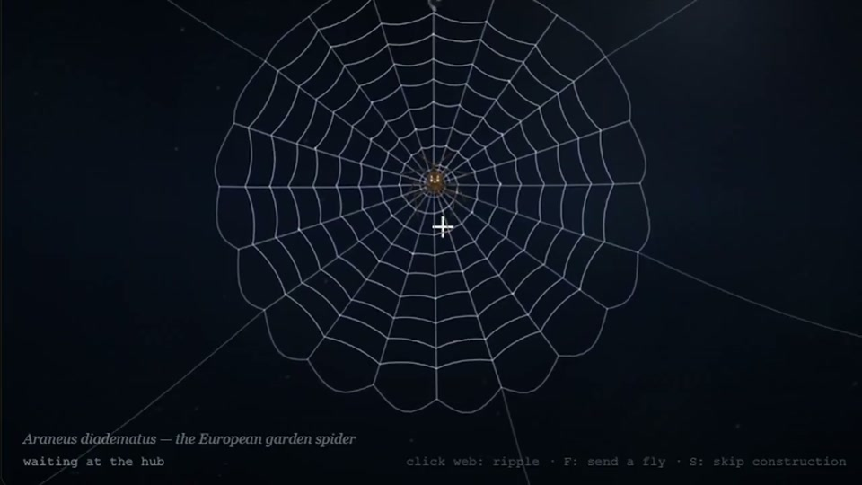</a> <a href="https://beatapi.io/prompts/qwen4/spider-web-214830?utm_source=github&amp;utm_medium=gallery&amp;utm_campaign=awesome-qwen4-videos"><strong>A spider builds a web</strong></a> Max · OpenCode · 39s <a href="cases/spider-web-214830.md">Prompt</a> · <a href="https://x.com/he1000se/status/2122178066273214830">@he1000se</a></td>
<td width="33%" valign="top"> <a href="https://beatapi.io/prompts/qwen4/svg-pelican-motion-263601?utm_source=github&amp;utm_medium=gallery&amp;utm_campaign=awesome-qwen4-videos"><strong>SVG pelican cycling animation</strong></a> Max · 8s <a href="cases/svg-pelican-motion-263601.md">Prompt</a> · <a href="https://x.com/oldfrog123/status/2122161445488263601">@oldfrog123</a></td>
<td width="33%" valign="top"><a href="https://beatapi.io/prompts/qwen4/electric-motor-comparison-352257?utm_source=github&amp;utm_medium=gallery&amp;utm_campaign=awesome-qwen4-videos">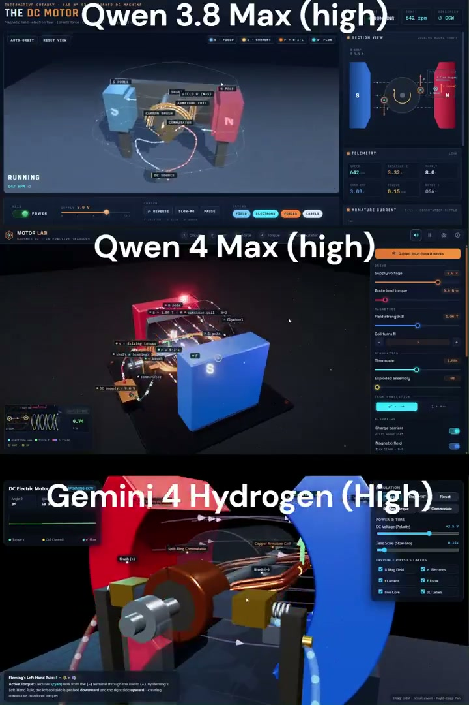</a> <a href="https://beatapi.io/prompts/qwen4/electric-motor-comparison-352257?utm_source=github&amp;utm_medium=gallery&amp;utm_campaign=awesome-qwen4-videos"><strong>Electric motor simulation: model comparison</strong></a> Max · 14s <a href="cases/electric-motor-comparison-352257.md">Prompt</a> · <a href="https://x.com/analogalok/status/2122221106304352257">@analogalok</a></td>
</tr>
<tr>
<td width="33%" valign="top"><a href="https://beatapi.io/prompts/qwen4/wrecking-ball-physics-437262?utm_source=github&amp;utm_medium=gallery&amp;utm_campaign=awesome-qwen4-videos">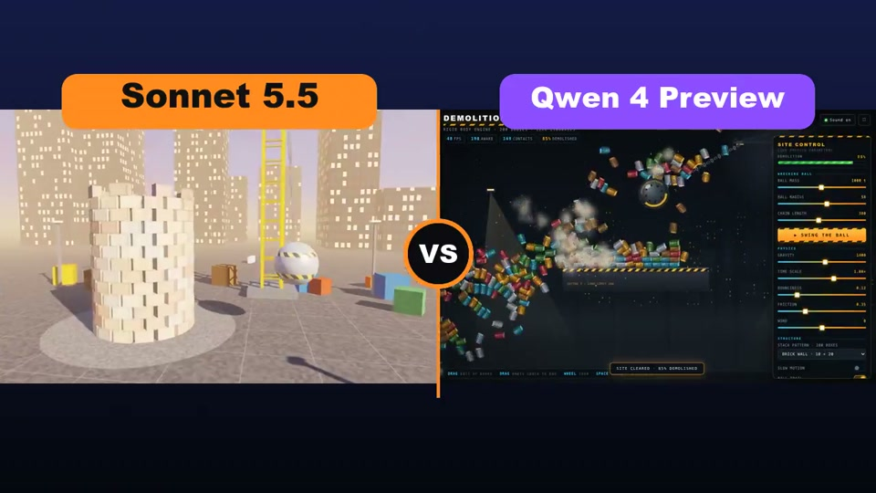</a> <a href="https://beatapi.io/prompts/qwen4/wrecking-ball-physics-437262?utm_source=github&amp;utm_medium=gallery&amp;utm_campaign=awesome-qwen4-videos"><strong>Wrecking ball physics: Qwen vs Sonnet</strong></a> Max-Preview · 18s <a href="cases/wrecking-ball-physics-437262.md">Prompt</a> · <a href="https://x.com/Josjesk/status/2120570762591437262">@Josjesk</a></td>
<td width="33%" valign="top"> <a href="https://beatapi.io/prompts/qwen4/evolving-creatures-565304?utm_source=github&amp;utm_medium=gallery&amp;utm_campaign=awesome-qwen4-videos"><strong>Creatures learning to walk</strong></a> Variant unspecified · 41s <a href="cases/evolving-creatures-565304.md">Prompt</a> · <a href="https://x.com/aijoey/status/2118744280491565304">@aijoey</a></td>
<td width="33%" valign="top"> <a href="https://beatapi.io/prompts/qwen4/crab-on-beach-434723?utm_source=github&amp;utm_medium=gallery&amp;utm_campaign=awesome-qwen4-videos"><strong>Crab on a beach: Qwen vs DeepSeek</strong></a> Max · 30s <a href="cases/crab-on-beach-434723.md">Case notes</a> · <a href="https://x.com/loktar00/status/2120383891605434723">@loktar00</a></td>
</tr>
<tr>
<td width="33%" valign="top"><a href="https://beatapi.io/prompts/qwen4/bugatti-assembly-229431?utm_source=github&amp;utm_medium=gallery&amp;utm_campaign=awesome-qwen4-videos">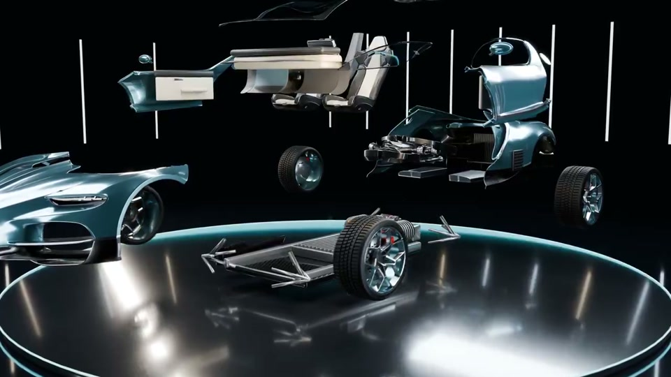</a> <a href="https://beatapi.io/prompts/qwen4/bugatti-assembly-229431?utm_source=github&amp;utm_medium=gallery&amp;utm_campaign=awesome-qwen4-videos"><strong>Bugatti assembly animation</strong></a> Variant unspecified · 10s <a href="cases/bugatti-assembly-229431.md">Prompt</a> · <a href="https://x.com/KobinFlow/status/2122320934187229431">@KobinFlow</a></td>
<td width="33%" valign="top"><a href="https://beatapi.io/prompts/qwen4/sunset-train-station-363349?utm_source=github&amp;utm_medium=gallery&amp;utm_campaign=awesome-qwen4-videos">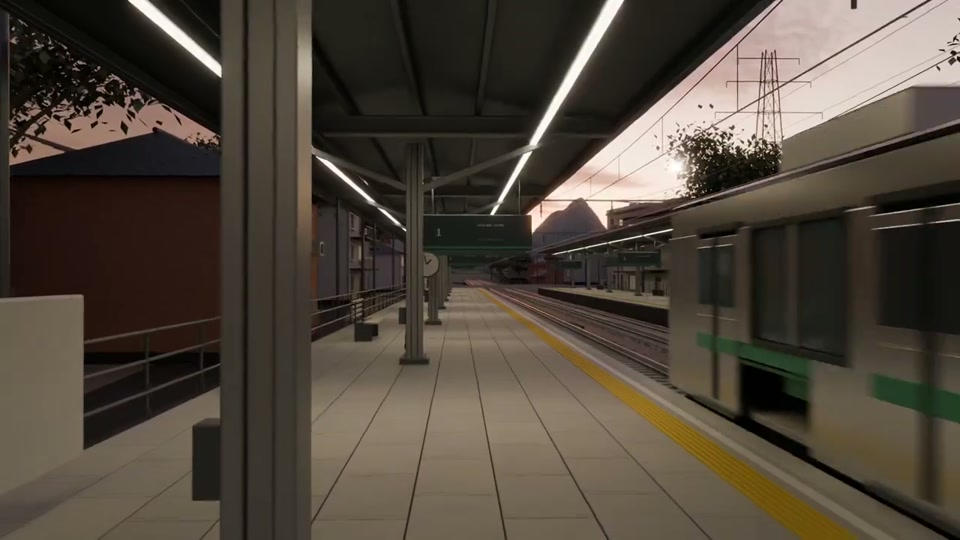</a> <a href="https://beatapi.io/prompts/qwen4/sunset-train-station-363349?utm_source=github&amp;utm_medium=gallery&amp;utm_campaign=awesome-qwen4-videos"><strong>Sunset train station in Blender</strong></a> Variant unspecified · Blender · 18s <a href="cases/sunset-train-station-363349.md">Case notes</a> · <a href="https://x.com/WattterDjiang/status/2122309270033363349">@WattterDjiang</a></td>
<td width="33%" valign="top"><a href="https://beatapi.io/prompts/qwen4/portal-ending-161745?utm_source=github&amp;utm_medium=gallery&amp;utm_campaign=awesome-qwen4-videos">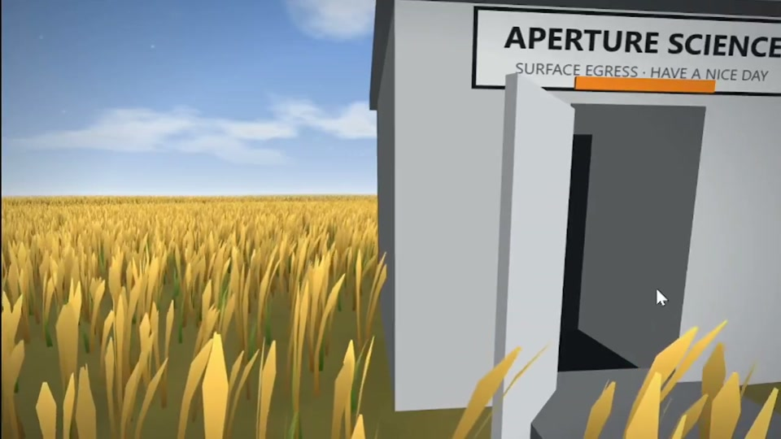</a> <a href="https://beatapi.io/prompts/qwen4/portal-ending-161745?utm_source=github&amp;utm_medium=gallery&amp;utm_campaign=awesome-qwen4-videos"><strong>Portal 2 ending in a browser</strong></a> Max · OpenCode · 44s <a href="cases/portal-ending-161745.md">Prompt</a> · <a href="https://x.com/he1000se/status/2122173095293161745">@he1000se</a></td>
</tr>
<tr>
<td width="33%" valign="top"> <a href="https://beatapi.io/prompts/qwen4/earth-flight-tour-818966?utm_source=github&amp;utm_medium=gallery&amp;utm_campaign=awesome-qwen4-videos"><strong>Interactive Earth and flight paths</strong></a> Max-Preview · Qoder · 17s <a href="cases/earth-flight-tour-818966.md">Case notes</a> · <a href="https://x.com/iamfakhrealam/status/2121996471830818966">@iamfakhrealam</a></td>
<td width="33%" valign="top"><a href="https://beatapi.io/prompts/qwen4/dragon-film-comparison-831302?utm_source=github&amp;utm_medium=gallery&amp;utm_campaign=awesome-qwen4-videos">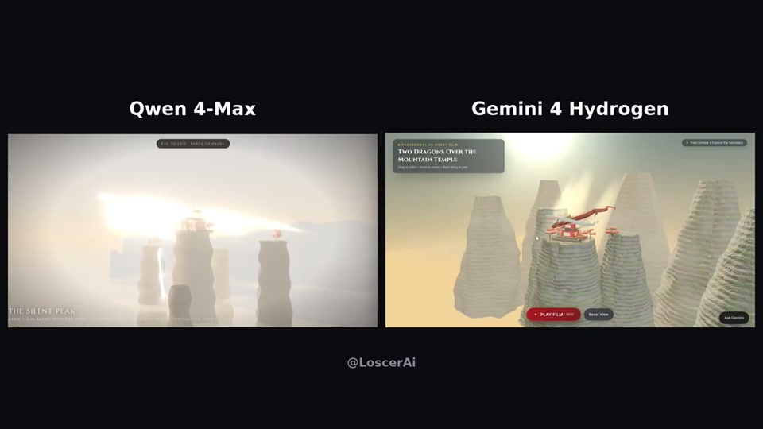</a> <a href="https://beatapi.io/prompts/qwen4/dragon-film-comparison-831302?utm_source=github&amp;utm_medium=gallery&amp;utm_campaign=awesome-qwen4-videos"><strong>Dragon fight: Qwen vs Gemini</strong></a> Max · 32s <a href="cases/dragon-film-comparison-831302.md">Case notes</a> · <a href="https://x.com/DrstaOne/status/2121947540509831302">@DrstaOne</a></td>
<td width="33%" valign="top"> <a href="https://beatapi.io/prompts/qwen4/hexapod-robot-249511?utm_source=github&amp;utm_medium=gallery&amp;utm_campaign=awesome-qwen4-videos"><strong>Six-legged robot with inverse kinematics</strong></a> Max-Preview · 43s <a href="cases/hexapod-robot-249511.md">Prompt</a> · <a href="https://x.com/wherecall1/status/2121931679510249511">@wherecall1</a></td>
</tr>
<tr>
<td width="33%" valign="top"><a href="https://beatapi.io/prompts/qwen4/pagoda-blueprint-883694?utm_source=github&amp;utm_medium=gallery&amp;utm_campaign=awesome-qwen4-videos">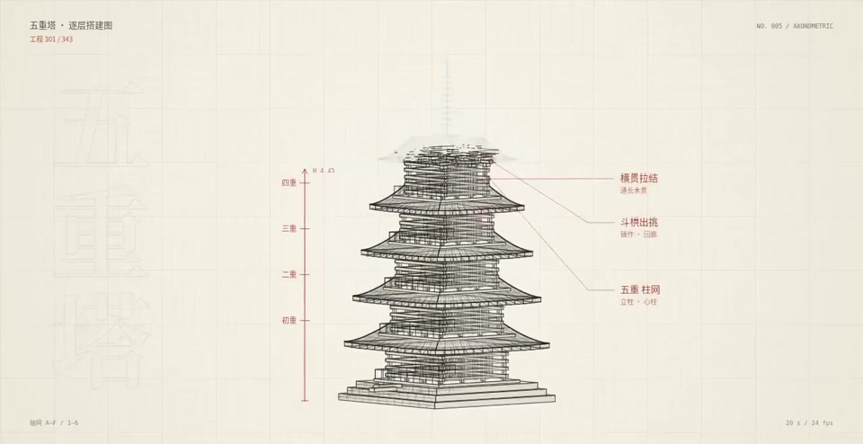</a> <a href="https://beatapi.io/prompts/qwen4/pagoda-blueprint-883694?utm_source=github&amp;utm_medium=gallery&amp;utm_campaign=awesome-qwen4-videos"><strong>Five-story pagoda: blueprint to construction</strong></a> Variant unspecified · 20s <a href="cases/pagoda-blueprint-883694.md">Case notes</a> · <a href="https://x.com/kkkeric_ai/status/2122303765755883694">@kkkeric_ai</a></td>
<td width="33%" valign="top"><a href="https://beatapi.io/prompts/qwen4/mechanical-moth-329697?utm_source=github&amp;utm_medium=gallery&amp;utm_campaign=awesome-qwen4-videos">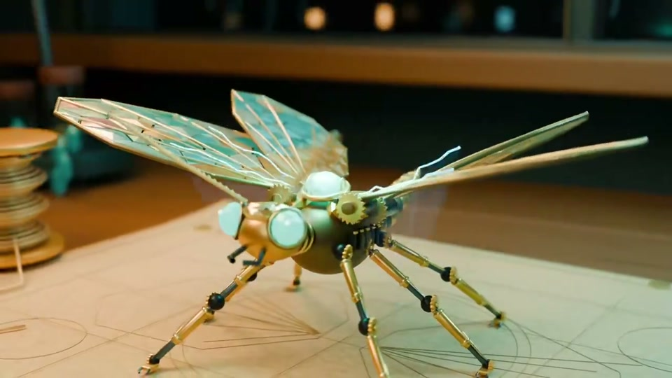</a> <a href="https://beatapi.io/prompts/qwen4/mechanical-moth-329697?utm_source=github&amp;utm_medium=gallery&amp;utm_campaign=awesome-qwen4-videos"><strong>A mechanical moth awakens</strong></a> Variant unspecified · 18s <a href="cases/mechanical-moth-329697.md">Prompt</a> · <a href="https://x.com/Cara_Mosquito/status/2122289829807329697">@Cara_Mosquito</a></td>
<td width="33%" valign="top"> <a href="https://beatapi.io/prompts/qwen4/pixel-jet-comparison-084386?utm_source=github&amp;utm_medium=gallery&amp;utm_campaign=awesome-qwen4-videos"><strong>Pixel jet in clouds: model comparison</strong></a> Max · Three.js · DeepSeek Harness · 60s <a href="cases/pixel-jet-comparison-084386.md">Case notes</a> · <a href="https://x.com/superalesha/status/2122284797301084386">@superalesha</a></td>
</tr>
<tr>
<td width="33%" valign="top"><a href="https://beatapi.io/prompts/qwen4/stickman-fight-392880?utm_source=github&amp;utm_medium=gallery&amp;utm_campaign=awesome-qwen4-videos">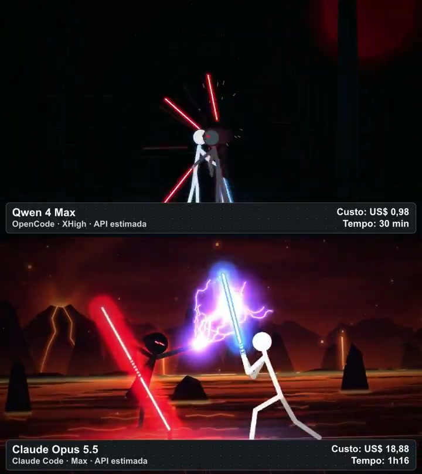</a> <a href="https://beatapi.io/prompts/qwen4/stickman-fight-392880?utm_source=github&amp;utm_medium=gallery&amp;utm_campaign=awesome-qwen4-videos"><strong>Stickman fight: Qwen vs Opus</strong></a> Max · 15s <a href="cases/stickman-fight-392880.md">Case notes</a> · <a href="https://x.com/DanielZambrini/status/2122272930113392880">@DanielZambrini</a></td>
<td width="33%" valign="top"> <a href="https://beatapi.io/prompts/qwen4/jasmine-piano-294428?utm_source=github&amp;utm_medium=gallery&amp;utm_campaign=awesome-qwen4-videos"><strong>Jasmine piano: Qwen vs DeepSeek</strong></a> Max · 71s <a href="cases/jasmine-piano-294428.md">Case notes</a> · <a href="https://x.com/leppppp1/status/2122260637015294428">@leppppp1</a></td>
<td width="33%" valign="top"><a href="https://beatapi.io/prompts/qwen4/titanic-scene-524468?utm_source=github&amp;utm_medium=gallery&amp;utm_campaign=awesome-qwen4-videos">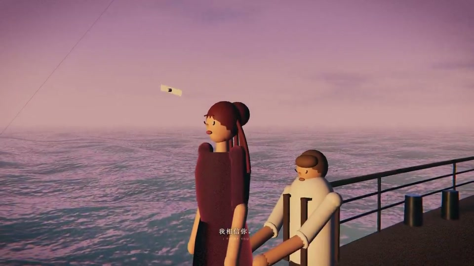</a> <a href="https://beatapi.io/prompts/qwen4/titanic-scene-524468?utm_source=github&amp;utm_medium=gallery&amp;utm_campaign=awesome-qwen4-videos"><strong>Titanic scene in 3D</strong></a> Max · Qoder · 92s <a href="cases/titanic-scene-524468.md">Prompt</a> · <a href="https://x.com/Aurora0x3f/status/2122260111502524468">@Aurora0x3f</a></td>
</tr>
<tr>
<td width="33%" valign="top"> <a href="https://beatapi.io/prompts/qwen4/controller-comparison-590204?utm_source=github&amp;utm_medium=gallery&amp;utm_campaign=awesome-qwen4-videos"><strong>PS5 controller: Qwen vs GPT</strong></a> Max · 31s <a href="cases/controller-comparison-590204.md">Case notes</a> · <a href="https://x.com/Stargridcompass/status/2122229600071590204">@Stargridcompass</a></td>
<td width="33%" valign="top"><a href="https://beatapi.io/prompts/qwen4/logging-truck-comparison-593923?utm_source=github&amp;utm_medium=gallery&amp;utm_campaign=awesome-qwen4-videos">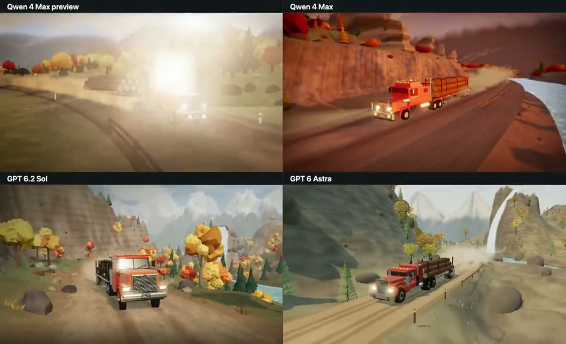</a> <a href="https://beatapi.io/prompts/qwen4/logging-truck-comparison-593923?utm_source=github&amp;utm_medium=gallery&amp;utm_campaign=awesome-qwen4-videos"><strong>Mountain logging truck: model comparison</strong></a> Max · Qoder · 20s <a href="cases/logging-truck-comparison-593923.md">Prompt</a> · <a href="https://x.com/Aurora0x3f/status/2122213713650593923">@Aurora0x3f</a></td>
<td width="33%" valign="top"> <a href="https://beatapi.io/prompts/qwen4/earth-data-comparison-471251?utm_source=github&amp;utm_medium=gallery&amp;utm_campaign=awesome-qwen4-videos"><strong>Earth visualization: Qwen vs GPT</strong></a> Max · 41s <a href="cases/earth-data-comparison-471251.md">Prompt</a> · <a href="https://x.com/Stargridcompass/status/2122206489280471251">@Stargridcompass</a></td>
</tr>
<tr>
<td width="33%" valign="top"><a href="https://beatapi.io/prompts/qwen4/mechanical-octopus-036396?utm_source=github&amp;utm_medium=gallery&amp;utm_campaign=awesome-qwen4-videos">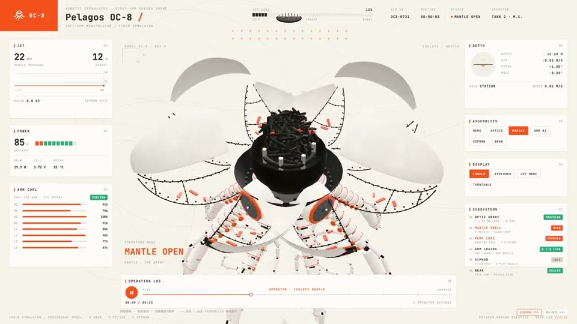</a> <a href="https://beatapi.io/prompts/qwen4/mechanical-octopus-036396?utm_source=github&amp;utm_medium=gallery&amp;utm_campaign=awesome-qwen4-videos"><strong>Mechanical octopus</strong></a> Max-Preview · 25s <a href="cases/mechanical-octopus-036396.md">Case notes</a> · <a href="https://x.com/mspd4100/status/2122202467891036396">@mspd4100</a></td>
<td width="33%" valign="top"><a href="https://beatapi.io/prompts/qwen4/passionflower-335251?utm_source=github&amp;utm_medium=gallery&amp;utm_campaign=awesome-qwen4-videos">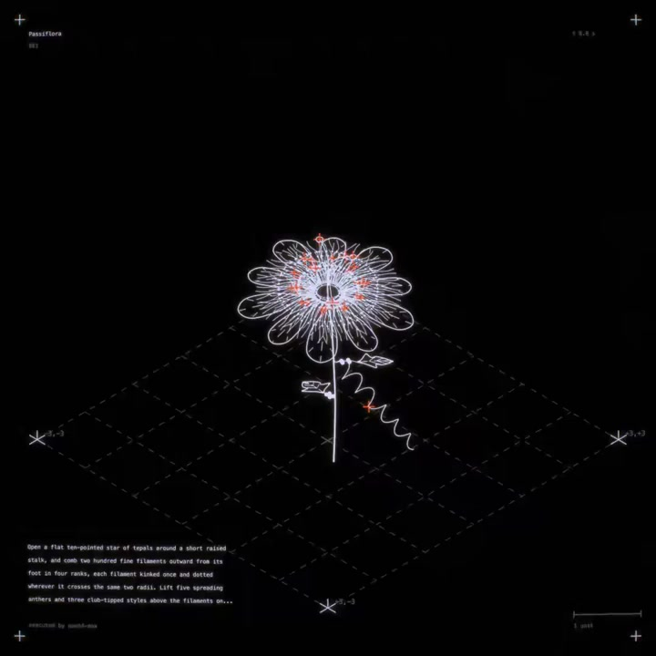</a> <a href="https://beatapi.io/prompts/qwen4/passionflower-335251?utm_source=github&amp;utm_medium=gallery&amp;utm_campaign=awesome-qwen4-videos"><strong>Procedurally drawn passionflower</strong></a> Max · 12s <a href="cases/passionflower-335251.md">Case notes</a> · <a href="https://x.com/InCartersEyes/status/2122190090512335251">@InCartersEyes</a></td>
<td width="33%" valign="top"> <a href="https://beatapi.io/prompts/qwen4/growing-geode-027335?utm_source=github&amp;utm_medium=gallery&amp;utm_campaign=awesome-qwen4-videos"><strong>A geode opens and grows crystals</strong></a> Max · 54s <a href="cases/growing-geode-027335.md">Case notes</a> · <a href="https://x.com/wikiwayne/status/2122189166218027335">@wikiwayne</a></td>
</tr>
<tr>
<td width="33%" valign="top"><a href="https://beatapi.io/prompts/qwen4/solar-system-animation-404080?utm_source=github&amp;utm_medium=gallery&amp;utm_campaign=awesome-qwen4-videos">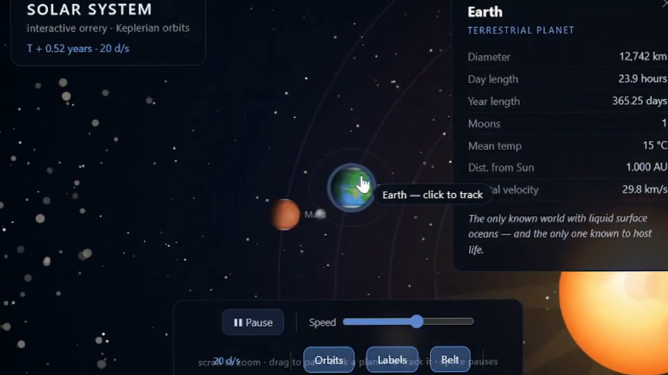</a> <a href="https://beatapi.io/prompts/qwen4/solar-system-animation-404080?utm_source=github&amp;utm_medium=gallery&amp;utm_campaign=awesome-qwen4-videos"><strong>Animated solar system</strong></a> Max · OpenCode · 28s <a href="cases/solar-system-animation-404080.md">Prompt</a> · <a href="https://x.com/he1000se/status/2122187692817404080">@he1000se</a></td>
<td width="33%" valign="top"> <a href="https://beatapi.io/prompts/qwen4/playful-fuzzy-icons-691323?utm_source=github&amp;utm_medium=gallery&amp;utm_campaign=awesome-qwen4-videos"><strong>Fuzzy icons and a bouncing ball</strong></a> Max-Preview · Qoder · 14s <a href="cases/playful-fuzzy-icons-691323.md">Case notes</a> · <a href="https://x.com/CodeByPoonam/status/2121231257346691323">@CodeByPoonam</a></td>
<td width="33%" valign="top"> <a href="https://beatapi.io/prompts/qwen4/navier-stokes-fluid-659401?utm_source=github&amp;utm_medium=gallery&amp;utm_campaign=awesome-qwen4-videos"><strong>Mouse-painted fluid simulation</strong></a> Variant unspecified · 56s <a href="cases/navier-stokes-fluid-659401.md">Prompt</a> · <a href="https://x.com/aijoey/status/2118760101263659401">@aijoey</a></td>
</tr>
<tr>
<td width="33%" valign="top"><a href="https://beatapi.io/prompts/qwen4/ink-water-comparison-271979?utm_source=github&amp;utm_medium=gallery&amp;utm_campaign=awesome-qwen4-videos">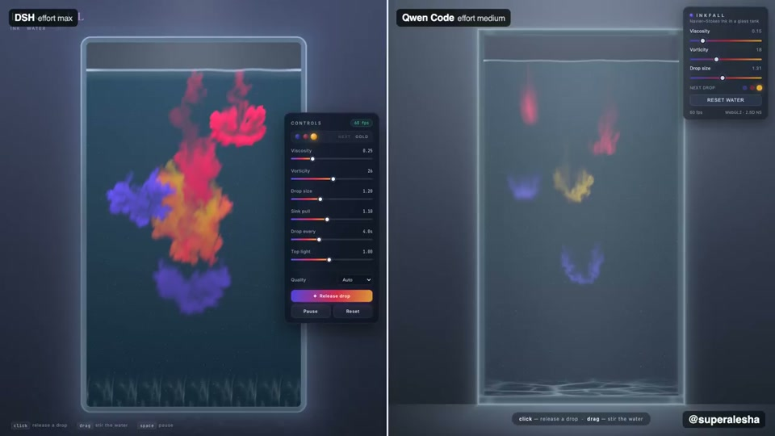</a> <a href="https://beatapi.io/prompts/qwen4/ink-water-comparison-271979?utm_source=github&amp;utm_medium=gallery&amp;utm_campaign=awesome-qwen4-videos"><strong>Ink in water: two coding tools</strong></a> Max-Preview · DeepSeek Harness · Qwen Code · 22s <a href="cases/ink-water-comparison-271979.md">Case notes</a> · <a href="https://x.com/superalesha/status/2120557983365271979">@superalesha</a></td>
<td width="33%" valign="top"><a href="https://beatapi.io/prompts/qwen4/four-stroke-engine-409754?utm_source=github&amp;utm_medium=gallery&amp;utm_campaign=awesome-qwen4-videos">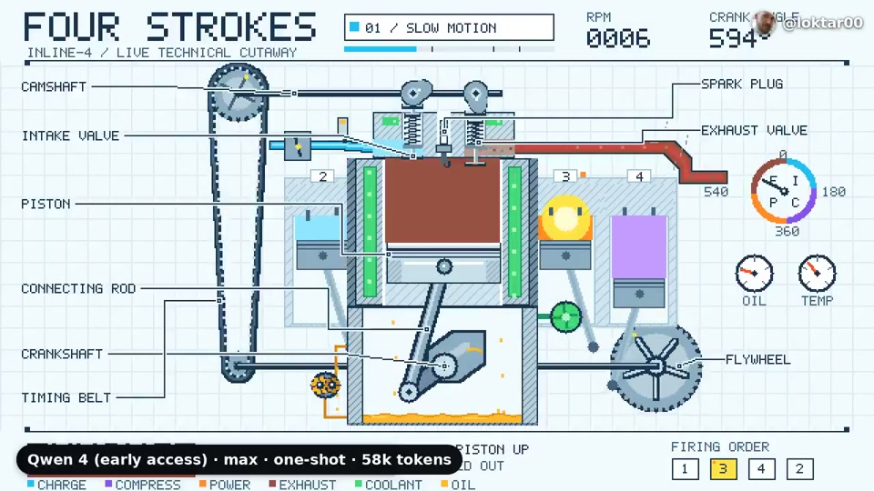</a> <a href="https://beatapi.io/prompts/qwen4/four-stroke-engine-409754?utm_source=github&amp;utm_medium=gallery&amp;utm_campaign=awesome-qwen4-videos"><strong>Four-stroke engine animation</strong></a> Max-Preview · 30s <a href="cases/four-stroke-engine-409754.md">Case notes</a> · <a href="https://x.com/loktar00/status/2118816945508409754">@loktar00</a></td>
<td width="33%" valign="top"><a href="https://beatapi.io/prompts/qwen4/interactive-solar-system-836897?utm_source=github&amp;utm_medium=gallery&amp;utm_campaign=awesome-qwen4-videos">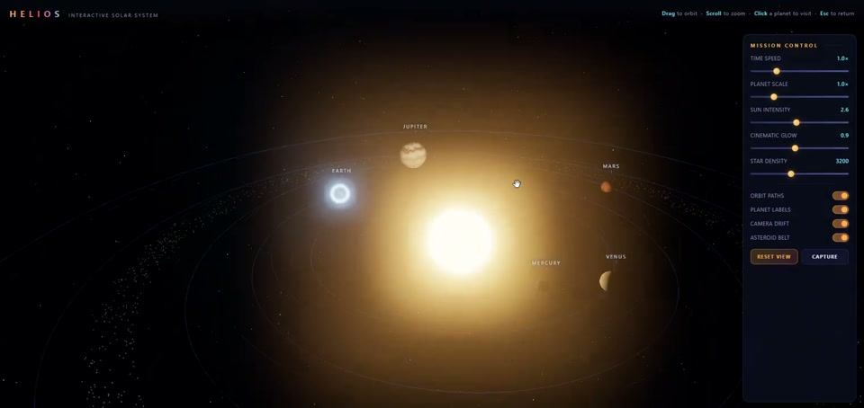</a> <a href="https://beatapi.io/prompts/qwen4/interactive-solar-system-836897?utm_source=github&amp;utm_medium=gallery&amp;utm_campaign=awesome-qwen4-videos"><strong>Interactive 3D solar system</strong></a> Max-Preview · Qoder · 15s <a href="cases/interactive-solar-system-836897.md">Case notes</a> · <a href="https://x.com/dylannknox/status/2120838990412836897">@dylannknox</a></td>
</tr>
<tr>
<td width="33%" valign="top"> <a href="https://beatapi.io/prompts/qwen4/city-night-to-sunrise-473027?utm_source=github&amp;utm_medium=gallery&amp;utm_campaign=awesome-qwen4-videos"><strong>City lights from night to sunrise</strong></a> Max-Preview · Qoder · 12s <a href="cases/city-night-to-sunrise-473027.md">Case notes</a> · <a href="https://x.com/sean_wallace_/status/2120838962386473027">@sean_wallace_</a></td>
<td width="33%" valign="top"><a href="https://beatapi.io/prompts/qwen4/sanxingdui-tree-346275?utm_source=github&amp;utm_medium=gallery&amp;utm_campaign=awesome-qwen4-videos">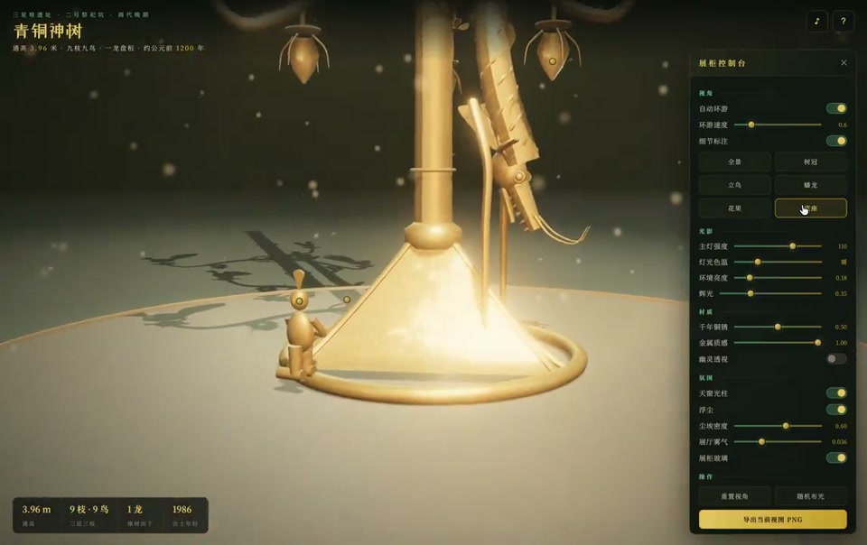</a> <a href="https://beatapi.io/prompts/qwen4/sanxingdui-tree-346275?utm_source=github&amp;utm_medium=gallery&amp;utm_campaign=awesome-qwen4-videos"><strong>Interactive Sanxingdui bronze tree</strong></a> Max-Preview · Three.js · Qoder · 55s <a href="cases/sanxingdui-tree-346275.md">Prompt</a> · <a href="https://x.com/bengtatsu/status/2120365514841346275">@bengtatsu</a></td>
<td width="33%" valign="top"><a href="https://beatapi.io/prompts/qwen4/webgl-solar-comparison-1xvg7sa?utm_source=github&amp;utm_medium=gallery&amp;utm_campaign=awesome-qwen4-videos">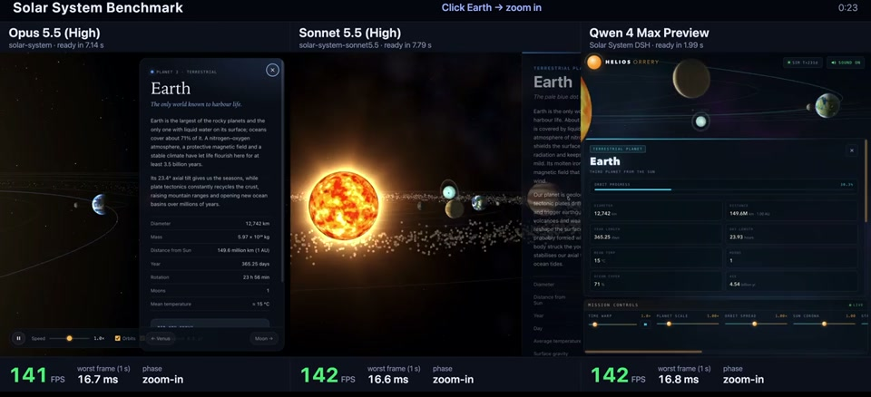</a> <a href="https://beatapi.io/prompts/qwen4/webgl-solar-comparison-1xvg7sa?utm_source=github&amp;utm_medium=gallery&amp;utm_campaign=awesome-qwen4-videos"><strong>Raw WebGL solar system: model comparison</strong></a> Max-Preview · WebGL · DeepSeek Harness · 69s <a href="cases/webgl-solar-comparison-1xvg7sa.md">Prompt</a> · <a href="https://www.reddit.com/r/Qwen_AI/comments/1xvg7sa/so_i_tried_qwen_4_max_preview_sorry_for_the/">@Nynyso</a></td>
</tr>
<tr>
<td width="33%" valign="top"> <a href="https://beatapi.io/prompts/qwen4/procedural-horse-comparison-1xurhf4?utm_source=github&amp;utm_medium=gallery&amp;utm_campaign=awesome-qwen4-videos"><strong>Procedural horse: model comparison</strong></a> Max-Preview · Three.js · Qoder · 19s <a href="cases/procedural-horse-comparison-1xurhf4.md">Prompt</a> · <a href="https://www.reddit.com/r/Qwen_AI/comments/1xurhf4/qwen_4_max_preview_vs_deepseek_v41_flash_horse/">@migsperez</a></td>
<td width="33%"></td>
<td width="33%"></td>
</tr>
</table>

## 3D worlds & games

37 cases in total; 1 featured above, 36 more below.

Featured in this category：[Floating moss garden in mist and rain](https://beatapi.io/prompts/qwen4/floating-moss-garden-563391?utm_source=github&utm_medium=gallery&utm_campaign=awesome-qwen4-videos)

<table>
<tr>
<td width="33%" valign="top"> <a href="https://beatapi.io/prompts/qwen4/neon-city-822686?utm_source=github&amp;utm_medium=gallery&amp;utm_campaign=awesome-qwen4-videos"><strong>Neon city, second attempt</strong></a> Max · 115s <a href="cases/neon-city-822686.md">Case notes</a> · <a href="https://x.com/Sabbirbyte/status/2122204889715822686">@Sabbirbyte</a></td>
<td width="33%" valign="top"> <a href="https://beatapi.io/prompts/qwen4/blender-tripo-game-449084?utm_source=github&amp;utm_medium=gallery&amp;utm_campaign=awesome-qwen4-videos"><strong>Game demo with Blender and Tripo</strong></a> Max · Blender · Tripo · 11s <a href="cases/blender-tripo-game-449084.md">Case notes</a> · <a href="https://x.com/Pluvio9yte/status/2122250996248449084">@Pluvio9yte</a></td>
<td width="33%" valign="top"> <a href="https://beatapi.io/prompts/qwen4/medieval-world-399531?utm_source=github&amp;utm_medium=gallery&amp;utm_campaign=awesome-qwen4-videos"><strong>Medieval open-world prototype</strong></a> Max · Three.js · 139s <a href="cases/medieval-world-399531.md">Case notes</a> · <a href="https://x.com/Sabbirbyte/status/2122212316754399531">@Sabbirbyte</a></td>
</tr>
<tr>
<td width="33%" valign="top"><a href="https://beatapi.io/prompts/qwen4/river-falling-leaves-302792?utm_source=github&amp;utm_medium=gallery&amp;utm_campaign=awesome-qwen4-videos">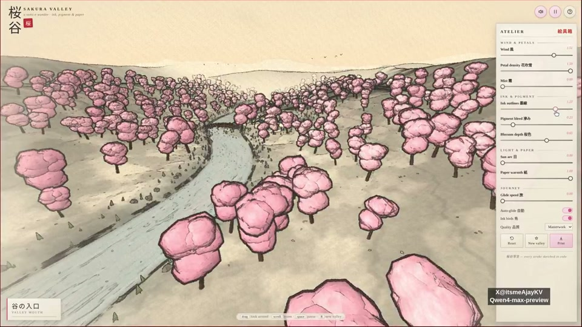</a> <a href="https://beatapi.io/prompts/qwen4/river-falling-leaves-302792?utm_source=github&amp;utm_medium=gallery&amp;utm_campaign=awesome-qwen4-videos"><strong>Custom renderer: river and falling leaves</strong></a> Max-Preview · HTML · 111s <a href="cases/river-falling-leaves-302792.md">Case notes</a> · <a href="https://x.com/ItsmeAjayKV/status/2121221346831302792">@ItsmeAjayKV</a></td>
<td width="33%" valign="top"> <a href="https://beatapi.io/prompts/qwen4/lantern-water-village-685426?utm_source=github&amp;utm_medium=gallery&amp;utm_campaign=awesome-qwen4-videos"><strong>Lantern village on the water</strong></a> Max-Preview · 62s <a href="cases/lantern-water-village-685426.md">Case notes</a> · <a href="https://x.com/ItsmeAjayKV/status/2121298050878685426">@ItsmeAjayKV</a></td>
<td width="33%" valign="top"> <a href="https://beatapi.io/prompts/qwen4/thousand-sunny-918494?utm_source=github&amp;utm_medium=gallery&amp;utm_campaign=awesome-qwen4-videos"><strong>Thousand Sunny: Max vs Preview</strong></a> Max · 20s <a href="cases/thousand-sunny-918494.md">Case notes</a> · <a href="https://x.com/PokeBenchTV/status/2122203182285918494">@PokeBenchTV</a></td>
</tr>
<tr>
<td width="33%" valign="top"> <a href="https://beatapi.io/prompts/qwen4/fishing-village-cycle-171550?utm_source=github&amp;utm_medium=gallery&amp;utm_campaign=awesome-qwen4-videos"><strong>Fishing village day cycle: model comparison</strong></a> Max · DeepSeek Harness · 60s <a href="cases/fishing-village-cycle-171550.md">Case notes</a> · <a href="https://x.com/superalesha/status/2122317512805171550">@superalesha</a></td>
<td width="33%" valign="top"><a href="https://beatapi.io/prompts/qwen4/browser-shooter-968466?utm_source=github&amp;utm_medium=gallery&amp;utm_campaign=awesome-qwen4-videos">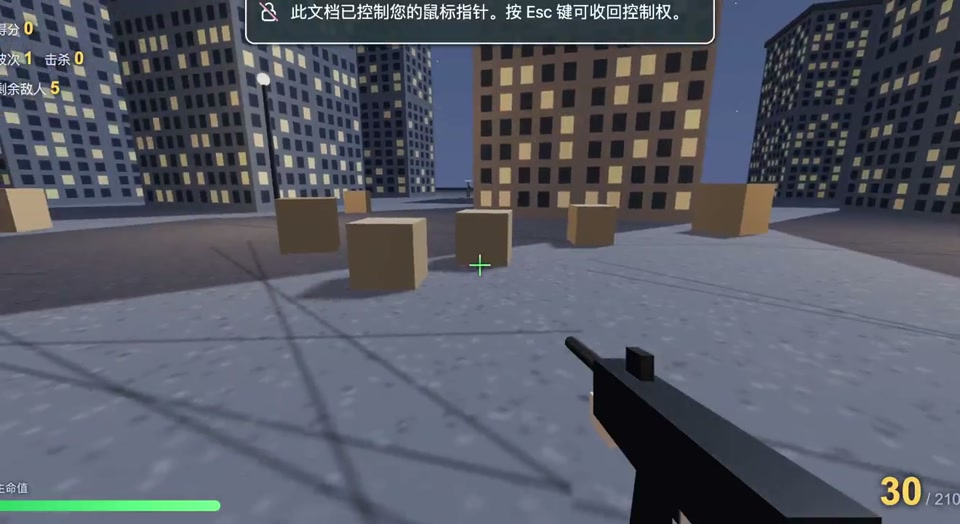</a> <a href="https://beatapi.io/prompts/qwen4/browser-shooter-968466?utm_source=github&amp;utm_medium=gallery&amp;utm_campaign=awesome-qwen4-videos"><strong>Single-file 3D shooting game</strong></a> Max · 24s <a href="cases/browser-shooter-968466.md">Prompt</a> · <a href="https://x.com/niandwo/status/2122179851901968466">@niandwo</a></td>
<td width="33%" valign="top"><a href="https://beatapi.io/prompts/qwen4/pixel-sky-island-138367?utm_source=github&amp;utm_medium=gallery&amp;utm_campaign=awesome-qwen4-videos">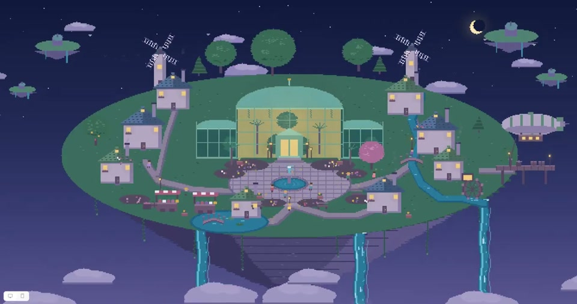</a> <a href="https://beatapi.io/prompts/qwen4/pixel-sky-island-138367?utm_source=github&amp;utm_medium=gallery&amp;utm_campaign=awesome-qwen4-videos"><strong>A floating pixel island</strong></a> Variant unspecified · 35s <a href="cases/pixel-sky-island-138367.md">Case notes</a> · <a href="https://x.com/CanopyWave_CW/status/2122173792265138367">@CanopyWave_CW</a></td>
</tr>
<tr>
<td width="33%" valign="top"> <a href="https://beatapi.io/prompts/qwen4/forest-light-comparison-523504?utm_source=github&amp;utm_medium=gallery&amp;utm_campaign=awesome-qwen4-videos"><strong>Forest lighting: model comparison</strong></a> Max-Preview · Three.js · 90s <a href="cases/forest-light-comparison-523504.md">Case notes</a> · <a href="https://x.com/superalesha/status/2122029835849523504">@superalesha</a></td>
<td width="33%" valign="top"><a href="https://beatapi.io/prompts/qwen4/gaussian-splat-doom-010388?utm_source=github&amp;utm_medium=gallery&amp;utm_campaign=awesome-qwen4-videos">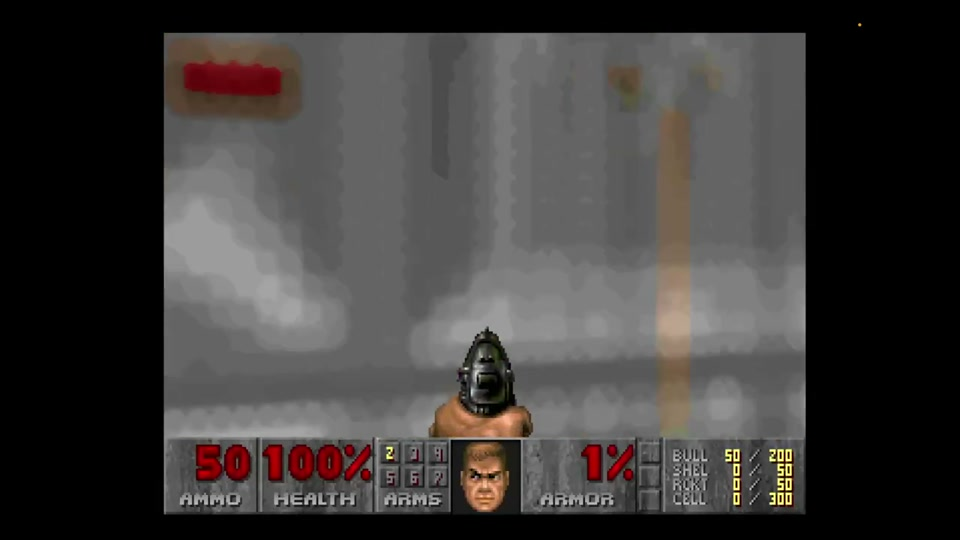</a> <a href="https://beatapi.io/prompts/qwen4/gaussian-splat-doom-010388?utm_source=github&amp;utm_medium=gallery&amp;utm_campaign=awesome-qwen4-videos"><strong>Doom with Gaussian splats</strong></a> Max-Preview · 49s <a href="cases/gaussian-splat-doom-010388.md">Case notes</a> · <a href="https://x.com/DrTBehrens/status/2122018725977010388">@DrTBehrens</a></td>
<td width="33%" valign="top"> <a href="https://beatapi.io/prompts/qwen4/living-oil-river-806221?utm_source=github&amp;utm_medium=gallery&amp;utm_campaign=awesome-qwen4-videos"><strong>A river as a living oil painting</strong></a> Max-Preview · Three.js · DeepSeek Harness · 202s <a href="cases/living-oil-river-806221.md">Case notes</a> · <a href="https://x.com/ItsmeAjayKV/status/2121982296563806221">@ItsmeAjayKV</a></td>
</tr>
<tr>
<td width="33%" valign="top"> <a href="https://beatapi.io/prompts/qwen4/island-portal-637258?utm_source=github&amp;utm_medium=gallery&amp;utm_campaign=awesome-qwen4-videos"><strong>Floating island with a magic portal</strong></a> Max-Preview · Three.js · DeepSeek Harness · 62s <a href="cases/island-portal-637258.md">Case notes</a> · <a href="https://x.com/ItsmeAjayKV/status/2121894489262637258">@ItsmeAjayKV</a></td>
<td width="33%" valign="top"> <a href="https://beatapi.io/prompts/qwen4/night-oak-comparison-662123?utm_source=github&amp;utm_medium=gallery&amp;utm_campaign=awesome-qwen4-videos"><strong>Gaussian-splat oak: model comparison</strong></a> Max · DeepSeek Harness · 36s <a href="cases/night-oak-comparison-662123.md">Case notes</a> · <a href="https://x.com/loktar00/status/2121774514698662123">@loktar00</a></td>
<td width="33%" valign="top"><a href="https://beatapi.io/prompts/qwen4/snowy-aurora-meadow-517872?utm_source=github&amp;utm_medium=gallery&amp;utm_campaign=awesome-qwen4-videos">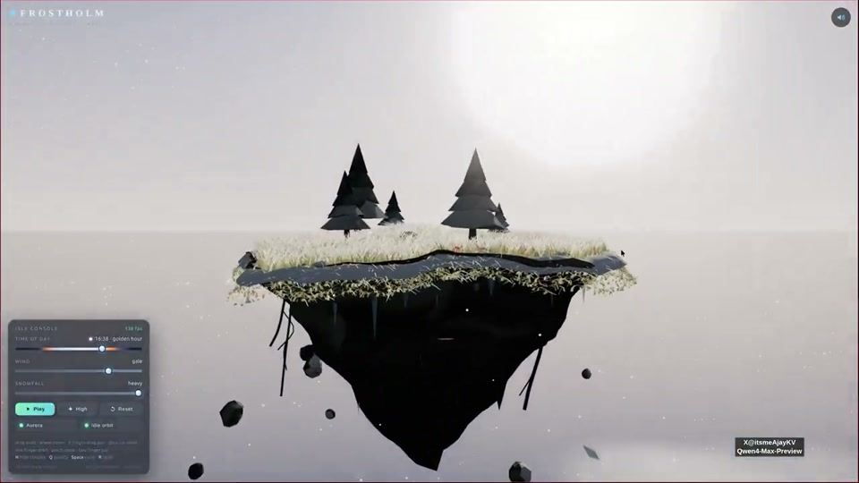</a> <a href="https://beatapi.io/prompts/qwen4/snowy-aurora-meadow-517872?utm_source=github&amp;utm_medium=gallery&amp;utm_campaign=awesome-qwen4-videos"><strong>Snowy meadow beneath an aurora</strong></a> Max-Preview · 90s <a href="cases/snowy-aurora-meadow-517872.md">Case notes</a> · <a href="https://x.com/ItsmeAjayKV/status/2121684794849517872">@ItsmeAjayKV</a></td>
</tr>
<tr>
<td width="33%" valign="top"><a href="https://beatapi.io/prompts/qwen4/skyholm-ruins-489858?utm_source=github&amp;utm_medium=gallery&amp;utm_campaign=awesome-qwen4-videos">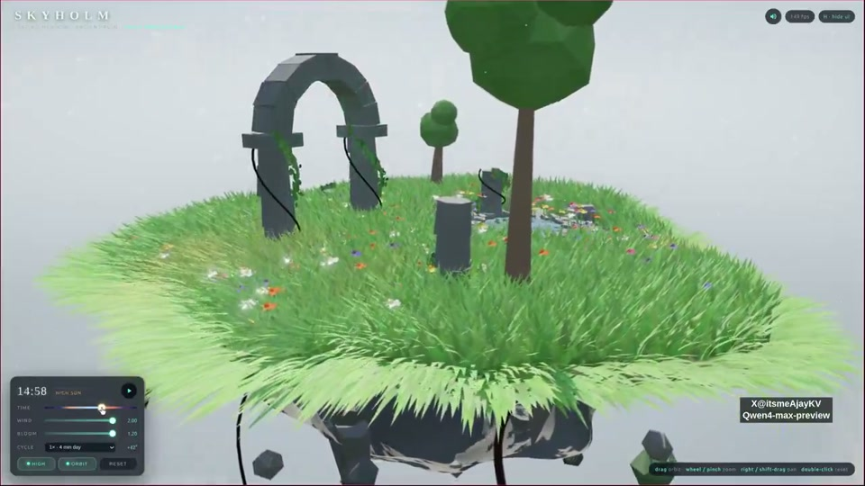</a> <a href="https://beatapi.io/prompts/qwen4/skyholm-ruins-489858?utm_source=github&amp;utm_medium=gallery&amp;utm_campaign=awesome-qwen4-videos"><strong>Skyholm: a meadow among floating ruins</strong></a> Max-Preview · 73s <a href="cases/skyholm-ruins-489858.md">Case notes</a> · <a href="https://x.com/ItsmeAjayKV/status/2121578415996489858">@ItsmeAjayKV</a></td>
<td width="33%" valign="top"><a href="https://beatapi.io/prompts/qwen4/flight-sim-replay-998401?utm_source=github&amp;utm_medium=gallery&amp;utm_campaign=awesome-qwen4-videos">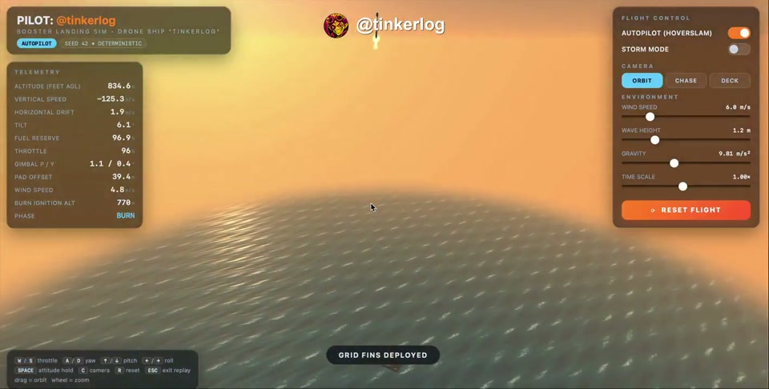</a> <a href="https://beatapi.io/prompts/qwen4/flight-sim-replay-998401?utm_source=github&amp;utm_medium=gallery&amp;utm_campaign=awesome-qwen4-videos"><strong>Flight simulator with cinematic replay</strong></a> Max · 93s <a href="cases/flight-sim-replay-998401.md">Case notes</a> · <a href="https://x.com/tinkerlog/status/2122304927732998401">@tinkerlog</a></td>
<td width="33%" valign="top"><a href="https://beatapi.io/prompts/qwen4/mount-fuji-comparison-505326?utm_source=github&amp;utm_medium=gallery&amp;utm_campaign=awesome-qwen4-videos">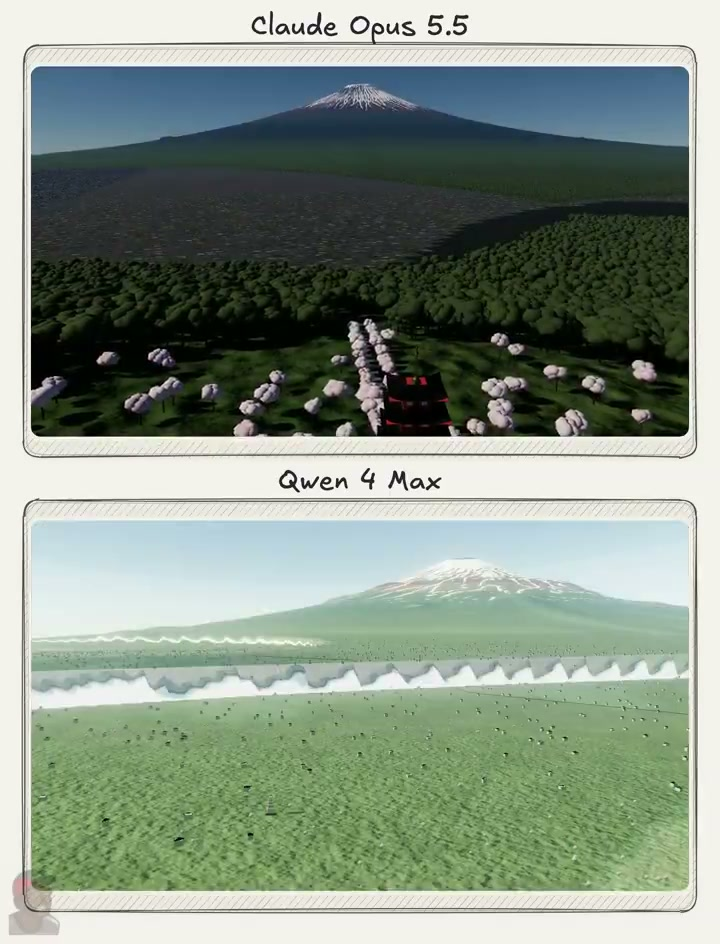</a> <a href="https://beatapi.io/prompts/qwen4/mount-fuji-comparison-505326?utm_source=github&amp;utm_medium=gallery&amp;utm_campaign=awesome-qwen4-videos"><strong>Mount Fuji: Qwen vs Opus</strong></a> Max · 54s <a href="cases/mount-fuji-comparison-505326.md">Prompt</a> · <a href="https://x.com/exploraX_/status/2122292875660505326">@exploraX_</a></td>
</tr>
<tr>
<td width="33%" valign="top"> <a href="https://beatapi.io/prompts/qwen4/interactive-ocean-019257?utm_source=github&amp;utm_medium=gallery&amp;utm_campaign=awesome-qwen4-videos"><strong>Interactive ocean waves</strong></a> Max · 14s <a href="cases/interactive-ocean-019257.md">Case notes</a> · <a href="https://x.com/edmand46/status/2122287799718019257">@edmand46</a></td>
<td width="33%" valign="top"> <a href="https://beatapi.io/prompts/qwen4/valley-seasons-113727?utm_source=github&amp;utm_medium=gallery&amp;utm_campaign=awesome-qwen4-videos"><strong>Valley seasons: model comparison</strong></a> Max · 24s <a href="cases/valley-seasons-113727.md">Case notes</a> · <a href="https://x.com/JangXiin/status/2122281418399113727">@JangXiin</a></td>
<td width="33%" valign="top"><a href="https://beatapi.io/prompts/qwen4/japanese-sketch-world-853541?utm_source=github&amp;utm_medium=gallery&amp;utm_campaign=awesome-qwen4-videos">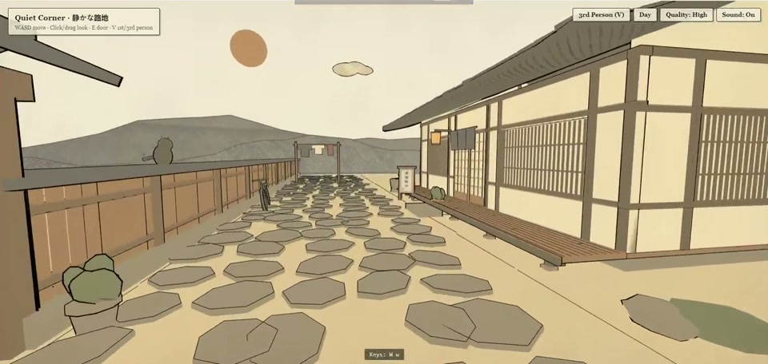</a> <a href="https://beatapi.io/prompts/qwen4/japanese-sketch-world-853541?utm_source=github&amp;utm_medium=gallery&amp;utm_campaign=awesome-qwen4-videos"><strong>A walkable Japanese sketch world</strong></a> Variant unspecified · 19s <a href="cases/japanese-sketch-world-853541.md">Case notes</a> · <a href="https://x.com/bebuu_ai/status/2122263328659853541">@bebuu_ai</a></td>
</tr>
<tr>
<td width="33%" valign="top"> <a href="https://beatapi.io/prompts/qwen4/sandbox-village-459841?utm_source=github&amp;utm_medium=gallery&amp;utm_campaign=awesome-qwen4-videos"><strong>2D sandbox village: Qwen vs Gemini</strong></a> Max · 55s <a href="cases/sandbox-village-459841.md">Case notes</a> · <a href="https://x.com/marcthecreatorr/status/2122266495216459841">@marcthecreatorr</a></td>
<td width="33%" valign="top"> <a href="https://beatapi.io/prompts/qwen4/tiki-island-492126?utm_source=github&amp;utm_medium=gallery&amp;utm_campaign=awesome-qwen4-videos"><strong>Isometric Tiki island</strong></a> Max · 44s <a href="cases/tiki-island-492126.md">Case notes</a> · <a href="https://x.com/debugsenpai/status/2122232158513492126">@debugsenpai</a></td>
<td width="33%" valign="top"><a href="https://beatapi.io/prompts/qwen4/seaside-boardwalk-933633?utm_source=github&amp;utm_medium=gallery&amp;utm_campaign=awesome-qwen4-videos">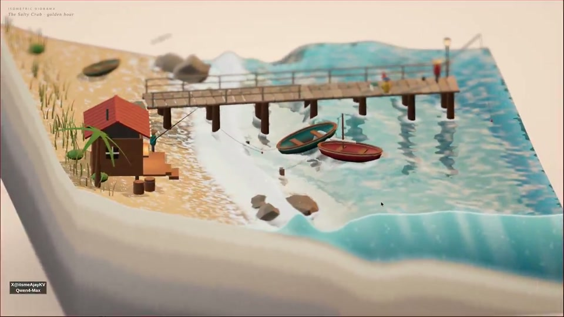</a> <a href="https://beatapi.io/prompts/qwen4/seaside-boardwalk-933633?utm_source=github&amp;utm_medium=gallery&amp;utm_campaign=awesome-qwen4-videos"><strong>Seaside boardwalk diorama</strong></a> Max-Preview · 47s <a href="cases/seaside-boardwalk-933633.md">Case notes</a> · <a href="https://x.com/ItsmeAjayKV/status/2122207033885933633">@ItsmeAjayKV</a></td>
</tr>
<tr>
<td width="33%" valign="top"> <a href="https://beatapi.io/prompts/qwen4/rainy-neon-window-463971?utm_source=github&amp;utm_medium=gallery&amp;utm_campaign=awesome-qwen4-videos"><strong>Rain on a neon-lit window</strong></a> Max · 56s <a href="cases/rainy-neon-window-463971.md">Case notes</a> · <a href="https://x.com/wikiwayne/status/2122200491312463971">@wikiwayne</a></td>
<td width="33%" valign="top"> <a href="https://beatapi.io/prompts/qwen4/snake-game-692671?utm_source=github&amp;utm_medium=gallery&amp;utm_campaign=awesome-qwen4-videos"><strong>Browser snake game</strong></a> Variant unspecified · 54s <a href="cases/snake-game-692671.md">Case notes</a> · <a href="https://x.com/665162/status/2122199429482692671">@665162</a></td>
<td width="33%" valign="top"><a href="https://beatapi.io/prompts/qwen4/time-flashlight-920447?utm_source=github&amp;utm_medium=gallery&amp;utm_campaign=awesome-qwen4-videos">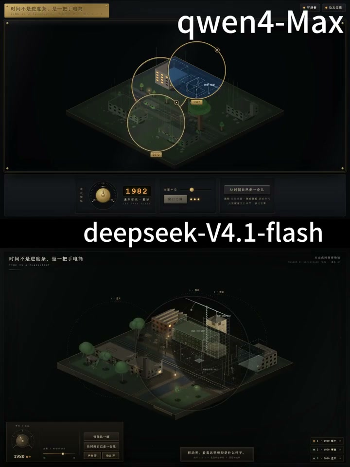</a> <a href="https://beatapi.io/prompts/qwen4/time-flashlight-920447?utm_source=github&amp;utm_medium=gallery&amp;utm_campaign=awesome-qwen4-videos"><strong>Time is a flashlight: model comparison</strong></a> Max · 41s <a href="cases/time-flashlight-920447.md">Prompt</a> · <a href="https://x.com/Densitylucky/status/2122186925343920447">@Densitylucky</a></td>
</tr>
<tr>
<td width="33%" valign="top"><a href="https://beatapi.io/prompts/qwen4/jellyfish-harness-comparison-715706?utm_source=github&amp;utm_medium=gallery&amp;utm_campaign=awesome-qwen4-videos">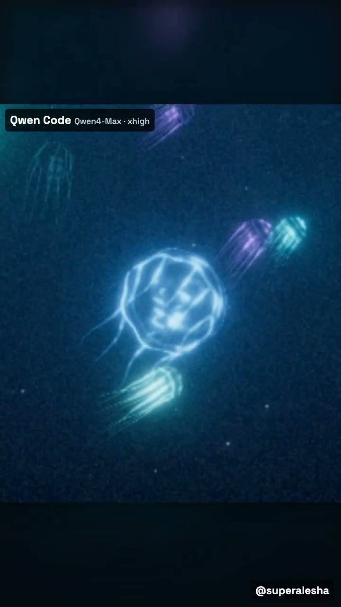</a> <a href="https://beatapi.io/prompts/qwen4/jellyfish-harness-comparison-715706?utm_source=github&amp;utm_medium=gallery&amp;utm_campaign=awesome-qwen4-videos"><strong>Glowing jellyfish: two coding tools</strong></a> Max · Three.js · DeepSeek Harness · 37s <a href="cases/jellyfish-harness-comparison-715706.md">Prompt</a> · <a href="https://x.com/superalesha/status/2120718224031715706">@superalesha</a></td>
<td width="33%" valign="top"> <a href="https://beatapi.io/prompts/qwen4/emberfall-isle-570832?utm_source=github&amp;utm_medium=gallery&amp;utm_campaign=awesome-qwen4-videos"><strong>Emberfall Isle at sunset</strong></a> Max-Preview · Qoder · 18s <a href="cases/emberfall-isle-570832.md">Prompt</a> · <a href="https://x.com/iam_chonchol/status/2120930740158570832">@iam_chonchol</a></td>
<td width="33%" valign="top"><a href="https://beatapi.io/prompts/qwen4/duckpond-village-887445?utm_source=github&amp;utm_medium=gallery&amp;utm_campaign=awesome-qwen4-videos">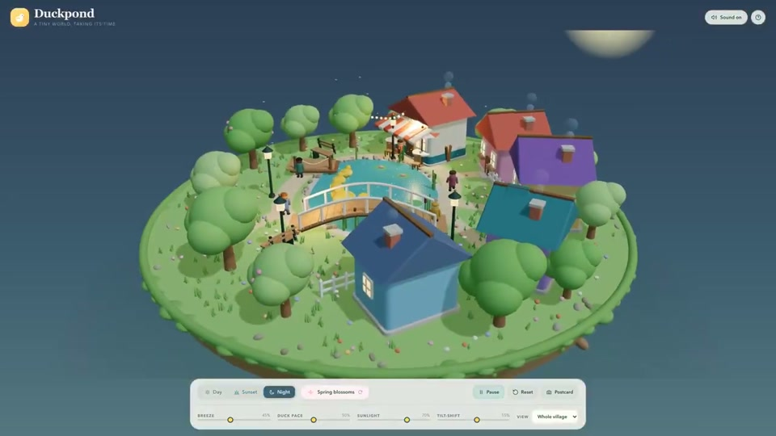</a> <a href="https://beatapi.io/prompts/qwen4/duckpond-village-887445?utm_source=github&amp;utm_medium=gallery&amp;utm_campaign=awesome-qwen4-videos"><strong>Duckpond: a village through four seasons</strong></a> Max-Preview · Qoder · 31s <a href="cases/duckpond-village-887445.md">Case notes</a> · <a href="https://x.com/jumperz/status/2120559352515887445">@jumperz</a></td>
</tr>
<tr>
<td width="33%" valign="top"><a href="https://beatapi.io/prompts/qwen4/neon-drift-196590?utm_source=github&amp;utm_medium=gallery&amp;utm_campaign=awesome-qwen4-videos">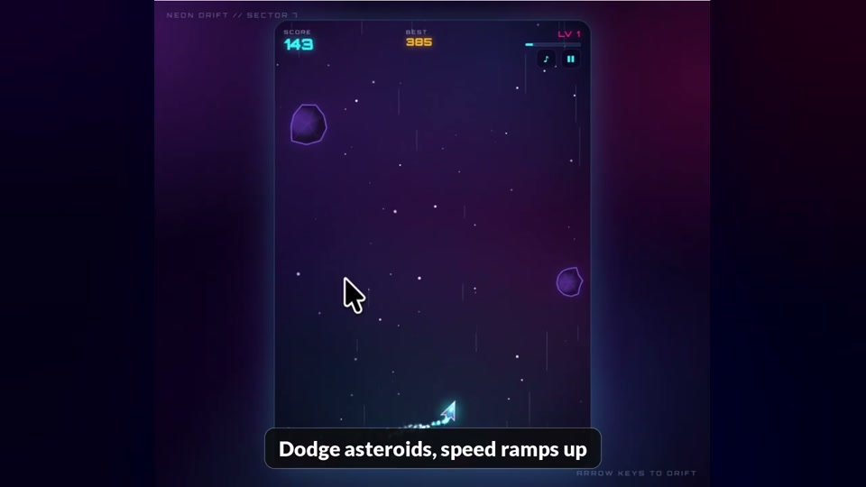</a> <a href="https://beatapi.io/prompts/qwen4/neon-drift-196590?utm_source=github&amp;utm_medium=gallery&amp;utm_campaign=awesome-qwen4-videos"><strong>Neon Drift asteroid game</strong></a> Max-Preview · Qoder · 21s <a href="cases/neon-drift-196590.md">Case notes</a> · <a href="https://x.com/alifcoder/status/2120537320399196590">@alifcoder</a></td>
<td width="33%" valign="top"> <a href="https://beatapi.io/prompts/qwen4/salt-widow-330015?utm_source=github&amp;utm_medium=gallery&amp;utm_campaign=awesome-qwen4-videos"><strong>The Salt Widow pirate ship</strong></a> Max-Preview · Qoder · 46s <a href="cases/salt-widow-330015.md">Case notes</a> · <a href="https://x.com/iam_elias1/status/2120513935577330015">@iam_elias1</a></td>
<td width="33%" valign="top"><a href="https://beatapi.io/prompts/qwen4/island-conservatory-592258?utm_source=github&amp;utm_medium=gallery&amp;utm_campaign=awesome-qwen4-videos">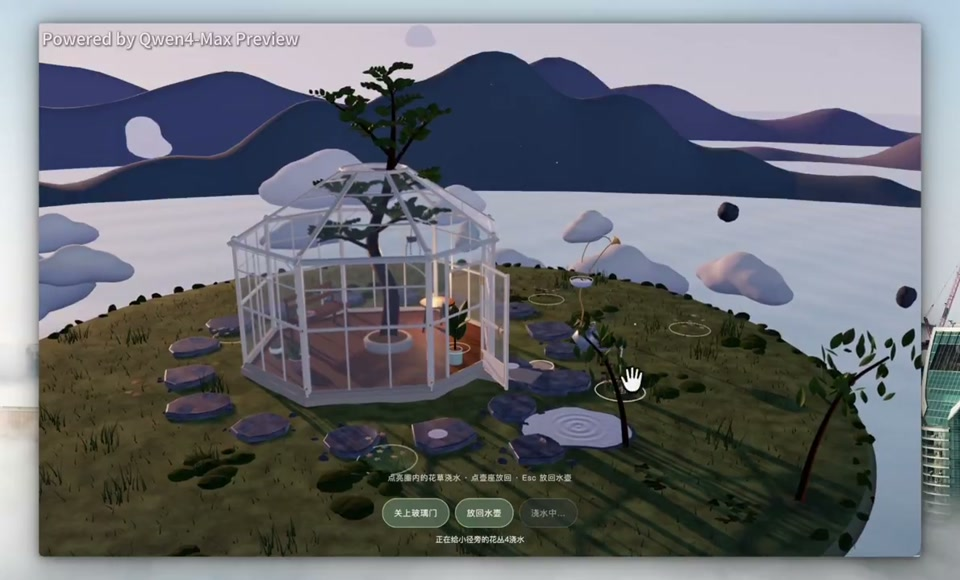</a> <a href="https://beatapi.io/prompts/qwen4/island-conservatory-592258?utm_source=github&amp;utm_medium=gallery&amp;utm_campaign=awesome-qwen4-videos"><strong>Floating island with a glass conservatory</strong></a> Max-Preview · 29s <a href="cases/island-conservatory-592258.md">Case notes</a> · <a href="https://x.com/yyyole/status/2120482243722592258">@yyyole</a></td>
</tr>
<tr>
<td width="33%" valign="top"><a href="https://beatapi.io/prompts/qwen4/fpv-drone-simulator-511605?utm_source=github&amp;utm_medium=gallery&amp;utm_campaign=awesome-qwen4-videos">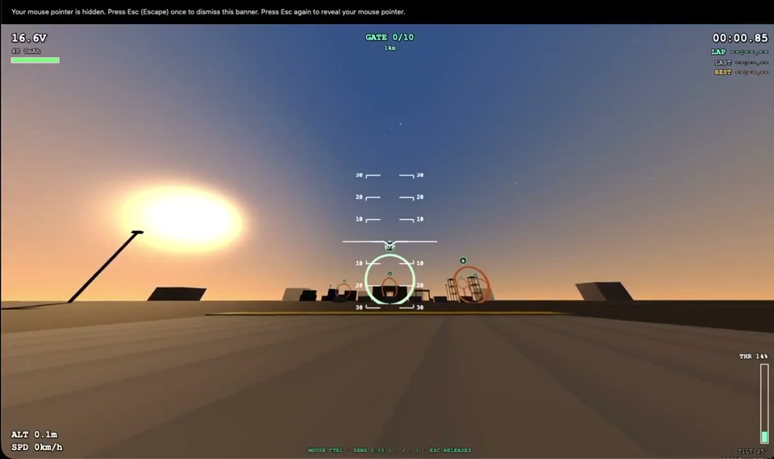</a> <a href="https://beatapi.io/prompts/qwen4/fpv-drone-simulator-511605?utm_source=github&amp;utm_medium=gallery&amp;utm_campaign=awesome-qwen4-videos"><strong>FPV drone simulator in acro mode</strong></a> Variant unspecified · 121s <a href="cases/fpv-drone-simulator-511605.md">Case notes</a> · <a href="https://x.com/aijoey/status/2118809899052511605">@aijoey</a></td>
<td width="33%" valign="top"> <a href="https://beatapi.io/prompts/qwen4/downhill-ski-game-409952?utm_source=github&amp;utm_medium=gallery&amp;utm_campaign=awesome-qwen4-videos"><strong>Downhill skiing mini game</strong></a> Max-Preview · Qoder · 63s <a href="cases/downhill-ski-game-409952.md">Case notes</a> · <a href="https://x.com/atulkumarzz/status/2120509534649409952">@atulkumarzz</a></td>
<td width="33%" valign="top"> <a href="https://beatapi.io/prompts/qwen4/chongqing-hotpot-887127?utm_source=github&amp;utm_medium=gallery&amp;utm_campaign=awesome-qwen4-videos"><strong>Interactive Chongqing hotpot</strong></a> Max-Preview · Qoder · 79s <a href="cases/chongqing-hotpot-887127.md">Prompt</a> · <a href="https://x.com/bengtatsu/status/2120466994457887127">@bengtatsu</a></td>
</tr>
</table>

## Workflow comparisons

6 cases.

<table>
<tr>
<td width="33%" valign="top"> <a href="https://beatapi.io/prompts/qwen4/harness-comparison-659334?utm_source=github&amp;utm_medium=gallery&amp;utm_campaign=awesome-qwen4-videos"><strong>Qwen Code and DeepSeek Harness comparison</strong></a> Max-Preview · DeepSeek Harness · HTML · 84s <a href="cases/harness-comparison-659334.md">Case notes</a> · <a href="https://x.com/EamonMcKiernan5/status/2122090559489659334">@EamonMcKiernan5</a></td>
<td width="33%" valign="top"> <a href="https://beatapi.io/prompts/qwen4/playable-violin-260584?utm_source=github&amp;utm_medium=gallery&amp;utm_campaign=awesome-qwen4-videos"><strong>A playable browser violin</strong></a> Max · OpenCode · 28s <a href="cases/playable-violin-260584.md">Prompt</a> · <a href="https://x.com/he1000se/status/2122164935761260584">@he1000se</a></td>
<td width="33%" valign="top"><a href="https://beatapi.io/prompts/qwen4/premium-isp-355486?utm_source=github&amp;utm_medium=gallery&amp;utm_campaign=awesome-qwen4-videos">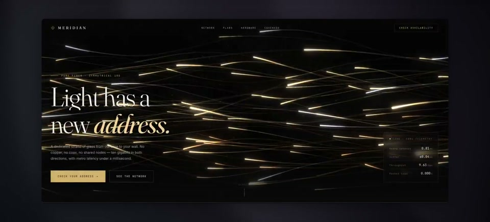</a> <a href="https://beatapi.io/prompts/qwen4/premium-isp-355486?utm_source=github&amp;utm_medium=gallery&amp;utm_campaign=awesome-qwen4-videos"><strong>Animated ISP landing page</strong></a> Max · Three.js · 33s <a href="cases/premium-isp-355486.md">Prompt</a> · <a href="https://x.com/atomtanstudio/status/2122158449161355486">@atomtanstudio</a></td>
</tr>
<tr>
<td width="33%" valign="top"><a href="https://beatapi.io/prompts/qwen4/perfume-motion-site-608775?utm_source=github&amp;utm_medium=gallery&amp;utm_campaign=awesome-qwen4-videos">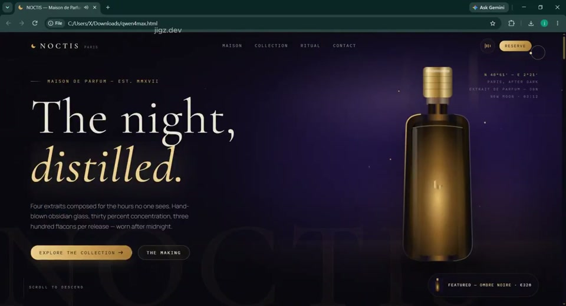</a> <a href="https://beatapi.io/prompts/qwen4/perfume-motion-site-608775?utm_source=github&amp;utm_medium=gallery&amp;utm_campaign=awesome-qwen4-videos"><strong>Perfume website with micro-animations</strong></a> Max · 22s <a href="cases/perfume-motion-site-608775.md">Case notes</a> · <a href="https://x.com/debugsenpai/status/2122278417219608775">@debugsenpai</a></td>
<td width="33%" valign="top"> <a href="https://beatapi.io/prompts/qwen4/velocity-showroom-876923?utm_source=github&amp;utm_medium=gallery&amp;utm_campaign=awesome-qwen4-videos"><strong>Velocity 3D car showroom</strong></a> Max-Preview · Qoder · 104s <a href="cases/velocity-showroom-876923.md">Case notes</a> · <a href="https://x.com/manishkumar_dev/status/2120503018403876923">@manishkumar_dev</a></td>
<td width="33%" valign="top"><a href="https://beatapi.io/prompts/qwen4/marginalia-atlas-1xtymff?utm_source=github&amp;utm_medium=gallery&amp;utm_campaign=awesome-qwen4-videos">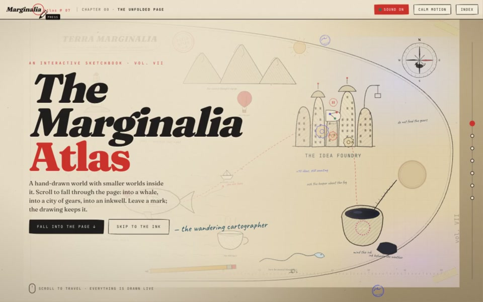</a> <a href="https://beatapi.io/prompts/qwen4/marginalia-atlas-1xtymff?utm_source=github&amp;utm_medium=gallery&amp;utm_campaign=awesome-qwen4-videos"><strong>The Marginalia Atlas: interactive sketchbook</strong></a> Max-Preview · 59s <a href="cases/marginalia-atlas-1xtymff.md">Prompt</a> · <a href="https://www.reddit.com/r/Qwen_AI/comments/1xtymff/qwen_4max_preview_vs_gpt_sol_61_max_webdev_test/">@Dear_Lock_5280</a></td>
</tr>
</table>

## How to watch and use

1. Open a cover or title to view the video and model details on BeatAPI.
2. Copy a published prompt on the detail page, or open its “Prompt” link in this repository.
3. Follow the creator’s tools, assets and instructions. Cases without a published prompt remain references for inspiration.

<a href="https://beatapi.io/prompts/qwen4/fisherman-oil-portrait-932340?utm_source=github&amp;utm_medium=gallery&amp;utm_campaign=awesome-qwen4-videos">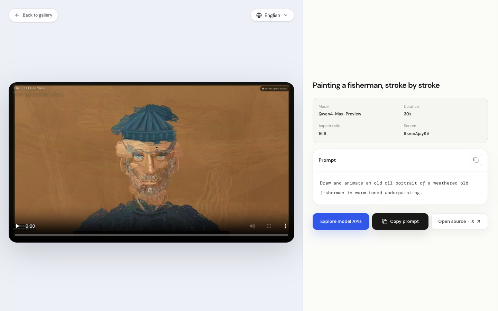</a>

*Watch the original recording and copy the creator-published prompt on BeatAPI.*

## Contributing & credits

Contribute a work, an original prompt or a broken-media report with its creator URL and exact model version. See [the contribution guide](CONTRIBUTING.md).

Model variants are preserved as reported by creators. These are recordings of code-generated work, not independent BeatAPI reproductions or a native video-generation API benchmark. BeatAPI hosts the videos and posters; creator links provide attribution. Missing prompts are not reconstructed as originals.

[Rights and attribution](THIRD_PARTY_NOTICES.md) · [Research and pending candidates](RESEARCH.md)
